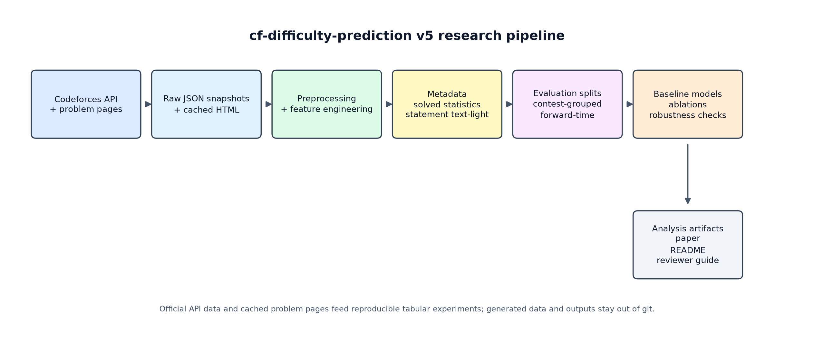
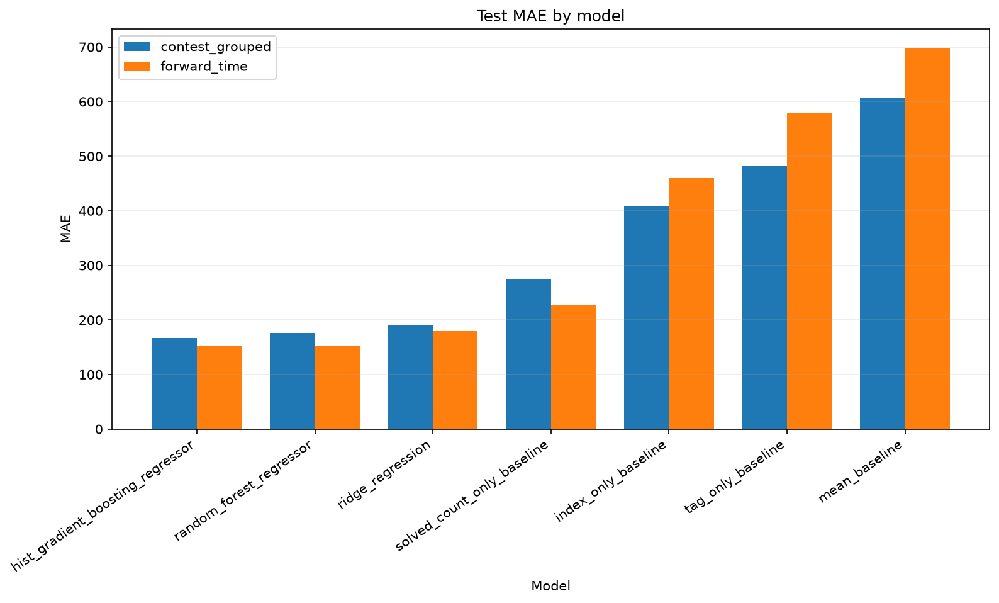
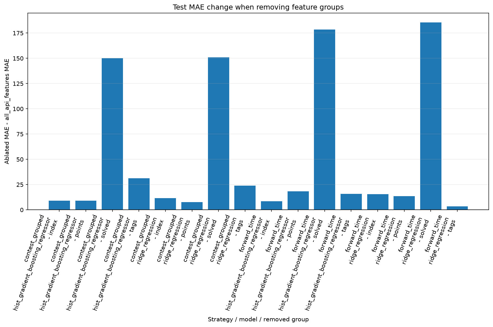
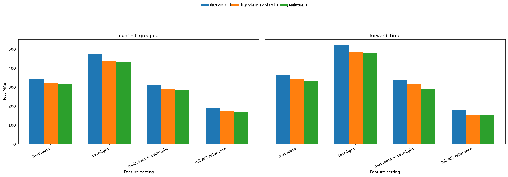
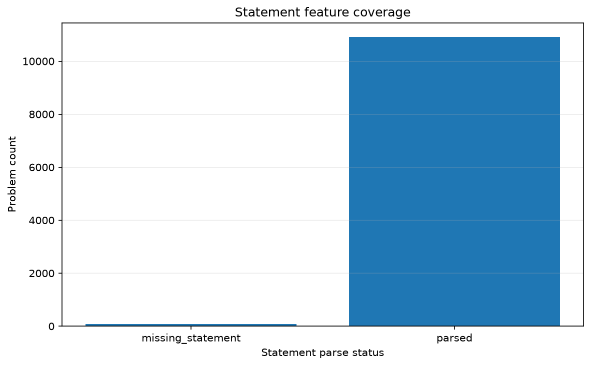
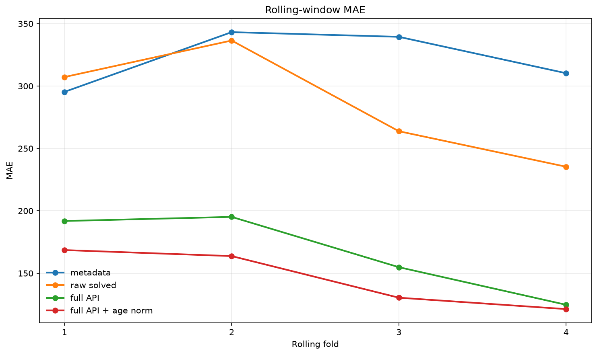

# Codeforces Difficulty Prediction

[](https://github.com/CmsChase/cf-difficulty-prediction/actions/workflows/tests.yml)

A reproducible v5 research pipeline for predicting Codeforces problem ratings
from official API metadata, solved statistics, exposure-aware features, and
lightweight statement-structure features.



## For reviewers

Start with [`REVIEWER_GUIDE.md`](REVIEWER_GUIDE.md). It gives the project goal,
research question, key contributions, main results, post-publication vs
cold-start distinction, reproducibility commands, and limitations in about two
minutes.

Final v5 paper artifacts:

- [`paper/paper_v5_full_en.md`](paper/paper_v5_full_en.md)
- [`paper/paper_v5_full_en_final.pdf`](paper/paper_v5_full_en_final.pdf)

## Project snapshot

| Experiment | Main setting | Best / key result | Interpretation |
|---|---|---:|---|
| Contest-grouped prediction | HGB full API | MAE 166.9, within +/-200 = 69.7% | Generalizes to unseen contests |
| Forward-time prediction | RF full API | MAE 152.5, within +/-200 = 71.2% | Tests chronological generalization |
| Solved-only baseline | solved-count only | MAE 227-274 | Strongest simple public signal |
| Cold-start prediction | metadata only | MAE 318-332 | New-problem prediction is much harder |
| v5 cold-start extension | metadata + text-light | MAE improves by 33.0-42.3 | Statement structure adds cold-start signal |
| Rolling temporal validation | full API + age norm | average MAE 146.0 | Best across rolling chronological folds |

## Research question

How well can Codeforces problem difficulty be predicted across
post-publication and cold-start settings using public metadata, solved-count
statistics, exposure-aware features, and lightweight problem-statement structure
features?

This project separates two settings:

- **Post-publication prediction:** solved-count statistics are available after a
  problem has been published and attempted by users.
- **Cold-start prediction:** solved-count statistics are unavailable, so the
  model must rely on metadata and statement structure.

> **Cold-start note:** Cold-start here means no solved-count behavior, not
> necessarily strict pre-contest prediction. Tags, metadata, and statement
> availability may not exactly match a real pre-contest setting; the project
> treats this limitation explicitly.

## Main findings

- The processed dataset contains 10,979 rated `PROGRAMMING` problems from 1,948
  contests.
- Ratings range from 800 to 3500.
- Solved-count-only is the strongest simple baseline in both contest-grouped and
  forward-time evaluation.
- Full API models improve over solved-count-only, showing that metadata and tags
  add complementary signal.
- Removing solved features causes the largest MAE increase in ablation studies.
- Cold-start metadata-only prediction is substantially harder than
  post-publication prediction.
- The v5 statement text-light extension improves cold-start prediction beyond
  metadata alone:
  - contest-grouped: MAE 317.1 -> 284.0;
  - forward-time: MAE 331.4 -> 289.1.
- Statement feature coverage is 99.3%: 10,906 parsed pages out of 10,979 rows,
  with 73 missing-statement rows handled by imputation.
- Age-normalized solved-count features are useful, but they are only partial
  exposure proxies.

## Key figures











## Repository structure

```text
configs/                 Experiment configuration
docs/                    Overview documentation assets
paper/                   Final v5 paper, figures, and historical paper artifacts
scripts/                 Local helper scripts
src/cf_diff/             Pipeline modules
tests/                   Unit tests
outputs/paper_tables/    Small committed paper-ready CSV tables
```

Large generated data, raw API snapshots, cached HTML pages, trained model
artifacts, logs, and experiment outputs are intentionally not committed.

## Setup

```powershell
python -m pip install -r requirements.txt
$env:PYTHONPATH = "src"
```

## Reproducible pipeline

Run from the repository root.

```powershell
python -m cf_diff.fetch_api --output-root data/raw/codeforces --lang en --sleep-seconds 2.1 --timeout 30 --latest-dir data/raw/codeforces/latest
python -m cf_diff.preprocess --raw-dir data/raw/codeforces/latest --interim-dir data/interim --processed-dir data/processed --log-path outputs/logs/preprocess.log
python -m cf_diff.features --config configs/experiment.yaml --input-path data/processed/rated_programming_problems.parquet --output-dir data/processed/features --log-path outputs/logs/features.log
python -m cf_diff.splits --config configs/experiment.yaml --input-path data/processed/features/model_table.parquet --output-dir data/processed/splits --log-path outputs/logs/splits.log
python -m cf_diff.eda --config configs/experiment.yaml --processed-path data/processed/rated_programming_problems.parquet --feature-path data/processed/features/model_table.parquet --contest-split-path data/processed/splits/contest_grouped_split.parquet --time-split-path data/processed/splits/forward_time_split.parquet --output-dir outputs/eda --log-path outputs/logs/eda.log
python -m cf_diff.baselines --config configs/experiment.yaml --feature-path data/processed/features/model_table.parquet --feature-columns-path data/processed/features/feature_columns.json --contest-split-path data/processed/splits/contest_grouped_split.parquet --time-split-path data/processed/splits/forward_time_split.parquet --output-dir outputs/baselines --log-path outputs/logs/baselines.log
python -m cf_diff.analysis --config configs/experiment.yaml --feature-path data/processed/features/model_table.parquet --feature-columns-path data/processed/features/feature_columns.json --contest-split-path data/processed/splits/contest_grouped_split.parquet --time-split-path data/processed/splits/forward_time_split.parquet --baseline-metrics-dir outputs/baselines/metrics --baseline-predictions-dir outputs/baselines/predictions --output-dir outputs/analysis --log-path outputs/logs/analysis.log
python -m cf_diff.ablations --config configs/experiment.yaml --feature-path data/processed/features/model_table.parquet --feature-columns-path data/processed/features/feature_columns.json --contest-split-path data/processed/splits/contest_grouped_split.parquet --time-split-path data/processed/splits/forward_time_split.parquet --output-dir outputs/ablations --log-path outputs/logs/ablations.log
python -m cf_diff.robustness --config configs/experiment.yaml --processed-path data/processed/rated_programming_problems.parquet --feature-path data/processed/features/model_table.parquet --feature-columns-path data/processed/features/feature_columns.json --contest-split-path data/processed/splits/contest_grouped_split.parquet --time-split-path data/processed/splits/forward_time_split.parquet --output-dir outputs/robustness --log-path outputs/logs/robustness.log
python -m cf_diff.statement_cold_start --feature-path data/processed/features/model_table.parquet --statement-feature-path data/processed/statement_features/statement_features.parquet --output-dir outputs/statement_cold_start --log-path outputs/logs/statement_cold_start.log
```

## v5 statement text-light feature extraction

If statement features need to be regenerated locally:

```powershell
python -m cf_diff.statement_features `
  --feature-path data/processed/features/model_table.parquet `
  --cache-dir data/raw/codeforces/problem_pages `
  --output-dir data/processed/statement_features `
  --sleep-seconds 2.5 `
  --timeout 30 `
  --log-path outputs/logs/statement_features.log
```

The extractor resumes from cached pages, so closing and restarting the process
does not discard already downloaded problem pages. The raw HTML cache and
generated statement feature outputs remain local artifacts.

## Browser demo note

The GitHub Pages site includes an illustrative browser-side demo for intuition.
It is heuristic, does not run trained research models, and is not part of the
reported experiments.

## v6 Semantic TF-IDF Extension

v6 is a separate semantic statement-text extension on top of the completed v5
research project. It extends cold-start prediction with classical TF-IDF
features extracted from normalized Codeforces problem-statement text.

This is not BERT, transformers, embeddings, LLMs, or deep semantic
understanding. It is a lightweight bag-of-words semantic baseline designed to
test whether statement text adds signal beyond metadata and v5 text-light
structure features.

Standalone v6 paper artifacts:

- [`paper/paper_v6_semantic_tfidf.md`](paper/paper_v6_semantic_tfidf.md)
- [`paper/paper_v6_semantic_tfidf_final.pdf`](paper/paper_v6_semantic_tfidf_final.pdf)

Main v6 findings:

- TF-IDF alone is weak.
- Metadata + TF-IDF improves over metadata only.
- Metadata + text-light + TF-IDF improves over metadata + text-light.
- The improvement is larger on forward-time validation than contest-grouped
  validation.
- v6 does not replace the canonical v5 full API benchmark; its
  `full_api_reference` is a ridge-based internal comparison.

Compact v6 results:

- Contest-grouped: metadata_only MAE 340.5 -> metadata_plus_tfidf MAE 311.1.
- Forward-time: metadata_only MAE 365.4 -> metadata_plus_tfidf MAE 325.4.
- Contest-grouped: metadata_plus_text_light MAE 310.6 ->
  metadata_plus_text_light_plus_tfidf MAE 298.5.
- Forward-time: metadata_plus_text_light MAE 335.8 ->
  metadata_plus_text_light_plus_tfidf MAE 316.2.

## Tests

```powershell
python -m pytest -q
```

Current tested state: `119 passed`.

## Notes on interpretation

The full API setting is a post-publication reference because solved-count
features are observed after problems have accumulated submissions. Cold-start
results exclude solved behavior. Statement text-light features are approximate
HTML-derived structure features, not semantic embeddings or deep NLP.

For data and artifact availability details, see
[`docs/data_manifest.md`](docs/data_manifest.md).
