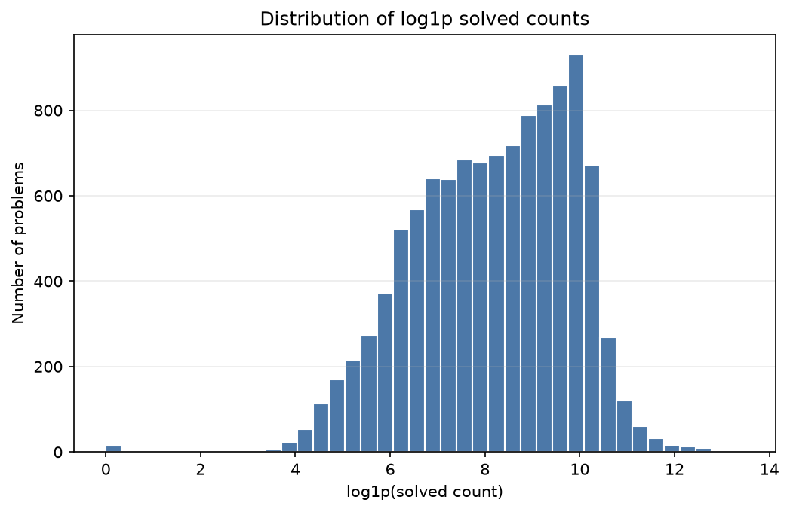
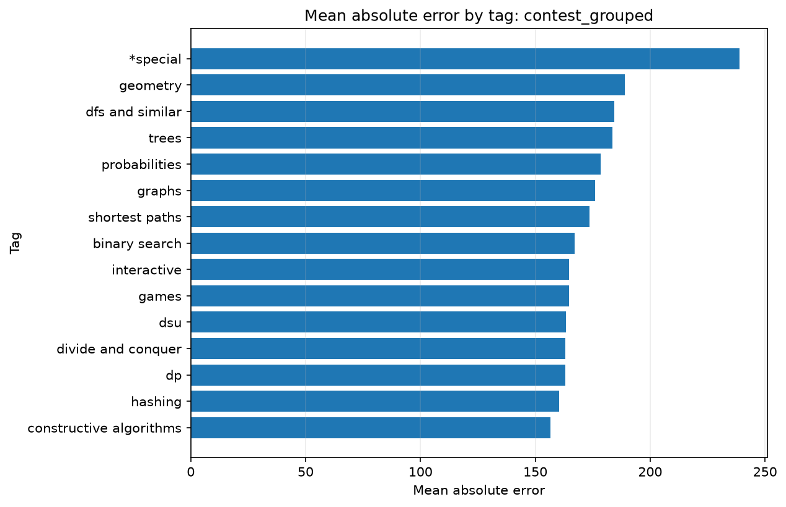

# 摘要

本项目研究如何利用 Codeforces 官方 API 中的公开元数据与解题统计来预测题目官方难度评分。当前数据集包含 10,979 道有评分的编程题，评分范围为 800 到 3500。在两个评估设置中，solved-count-only 都是最强的简单基线；完整模型仍进一步降低 MAE。消融实验显示，移除 `solved` 特征带来的 MAE 增幅最大。这些结果说明解题统计是核心信号，但元数据和标签仍能提供额外预测信息。

# 引言

Codeforces 题目评分可用于学习路径设计、题目推荐和竞赛分析。本研究关注一个可复现的问题：仅使用官方公开 API 中的结构化信息，能否有效预测官方评分。项目不使用网页抓取、私有数据或题面文本；目标不是替代官方评分，而是量化公开信号的预测能力与局限。

# 数据

建模表包含 10,979 道有评分的 `PROGRAMMING` 题目，来自 1,948 场比赛。评分范围为 800 到 3500。解题数分布高度偏斜：p50 为 4167，p99 为 73912，最大值为 700377。contest-grouped 切分的比赛重叠数为 0；forward-time 切分严格按时间排序：True。

数据概览见 `paper/tables/dataset_summary.md`。

# 方法

特征表保留题目标识、官方评分、比赛开始时间、题号派生特征、分值信息、解题数特征以及标签 one-hot 特征。评估采用两种切分：contest-grouped 用于避免同一比赛泄漏到多个集合；forward-time 用于检验时间外推能力。基线阶段包含简单基线、岭回归、随机森林和直方图梯度提升；消融阶段重点比较岭回归和直方图梯度提升在不同特征组下的表现。

# 结果

contest-grouped 测试集上，hist_gradient_boosting_regressor 的测试 MAE 最低，为 166.9。forward-time 测试集上，random_forest_regressor 的测试 MAE 最低，为 152.5。简单基线中，solved-count-only 强于 index-only 和 tag-only。完整模型仍优于 solved-count-only，说明其他结构化元数据仍有增益。forward-time 的训练/测试差距应被讨论为时间泛化差距或分布漂移，而不应自动解释为过拟合。

# 消融研究

最佳整体消融结果来自 `forward_time` 设置下的 `hist_gradient_boosting_regressor`，特征集合为 `all_api_features`，测试 MAE 为 153.0。单组移除实验显示，移除 `solved` 特征造成最大的 MAE 上升。这与 solved-count 信号的重要性一致。

# 错误分析

错误分析表列出最大绝对误差案例，并按标签和题号等级聚合平均绝对误差。这些结果用于定位公开结构化特征不足的区域，例如特殊题型或解题数与官方评分不一致的题目。该分析不声称因果解释，而是为后续人工复核提供诊断线索。

# 局限性

本研究只使用 Codeforces 官方公开 API 字段，不包含题面文本、题解、用户历史或解题时间序列。解题数虽然预测能力强，但同时反映题目曝光度、发布时间和流行度，不完全等同于内在难度。forward-time 切分能部分检验时间泛化，但未来数据仍可能受题型风格和参赛群体变化影响。

# 结论

在 10,979 道有评分编程题上，官方 API 元数据与解题统计能够支持较准确的难度预测。solved-count-only 是最强简单基线，但完整模型进一步改进了结果；消融实验也显示 solved 特征是最重要的公开信号组。这些产物为后续加入文本、时间动态和比赛上下文特征提供了可复现基础。
