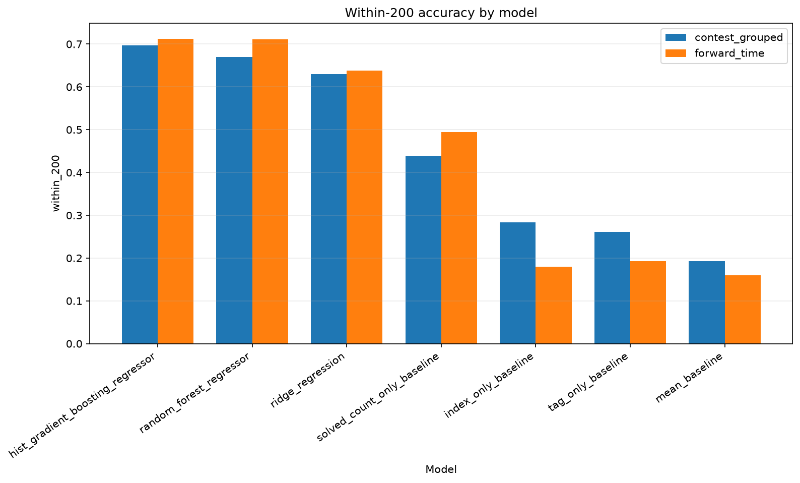
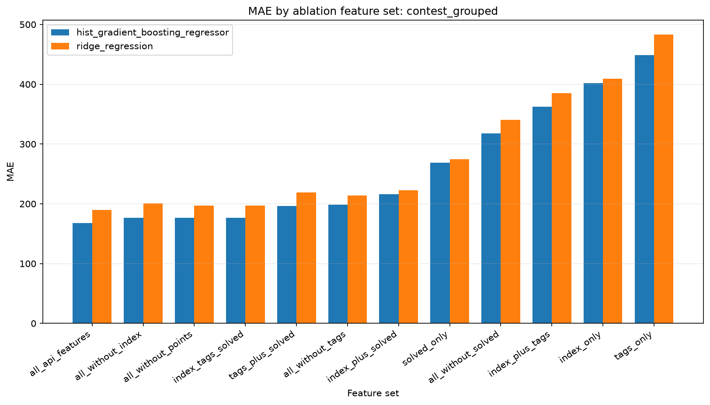
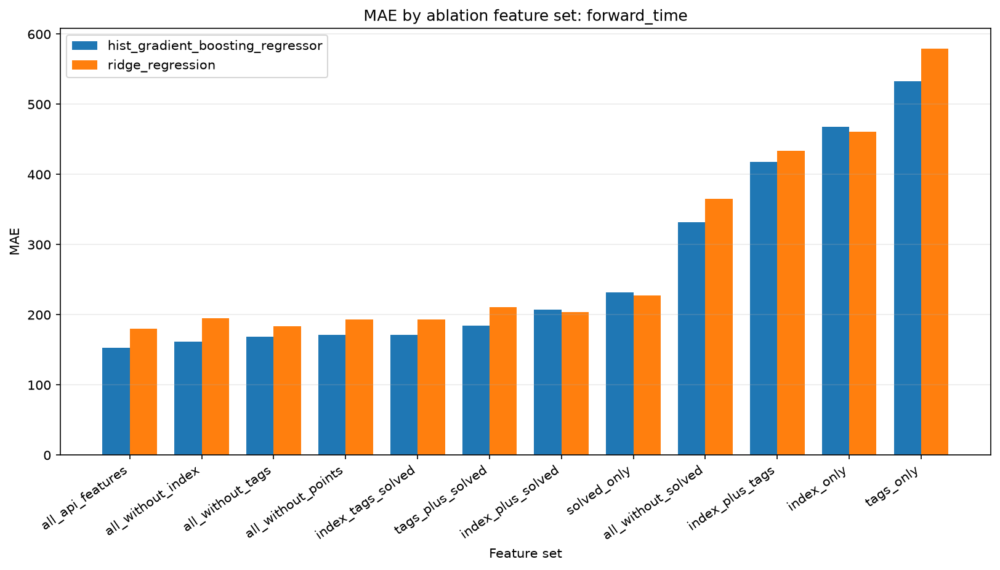
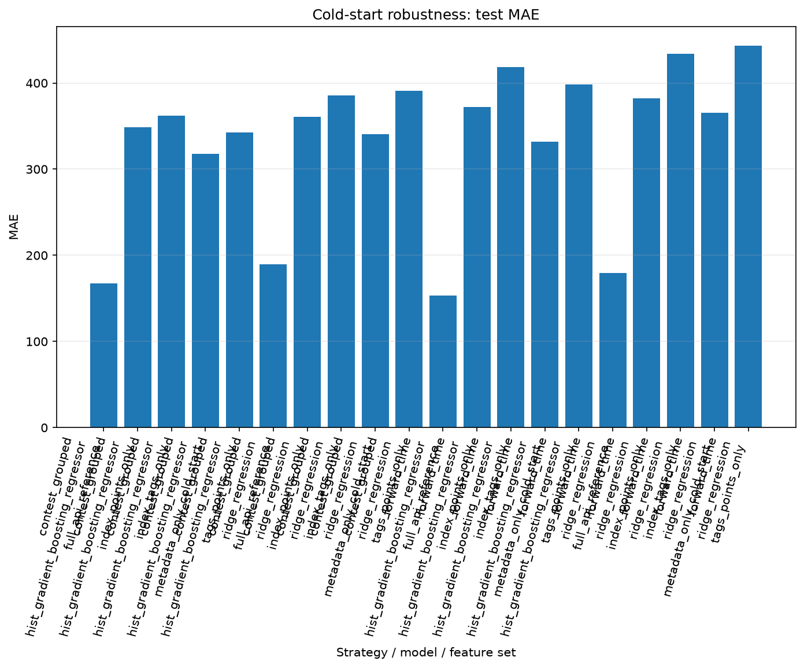
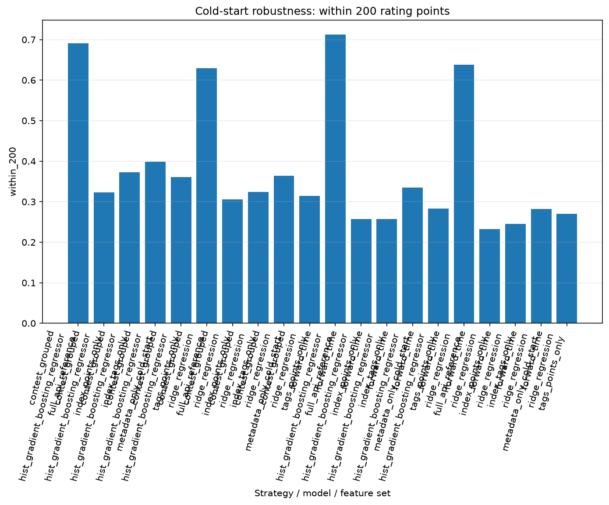
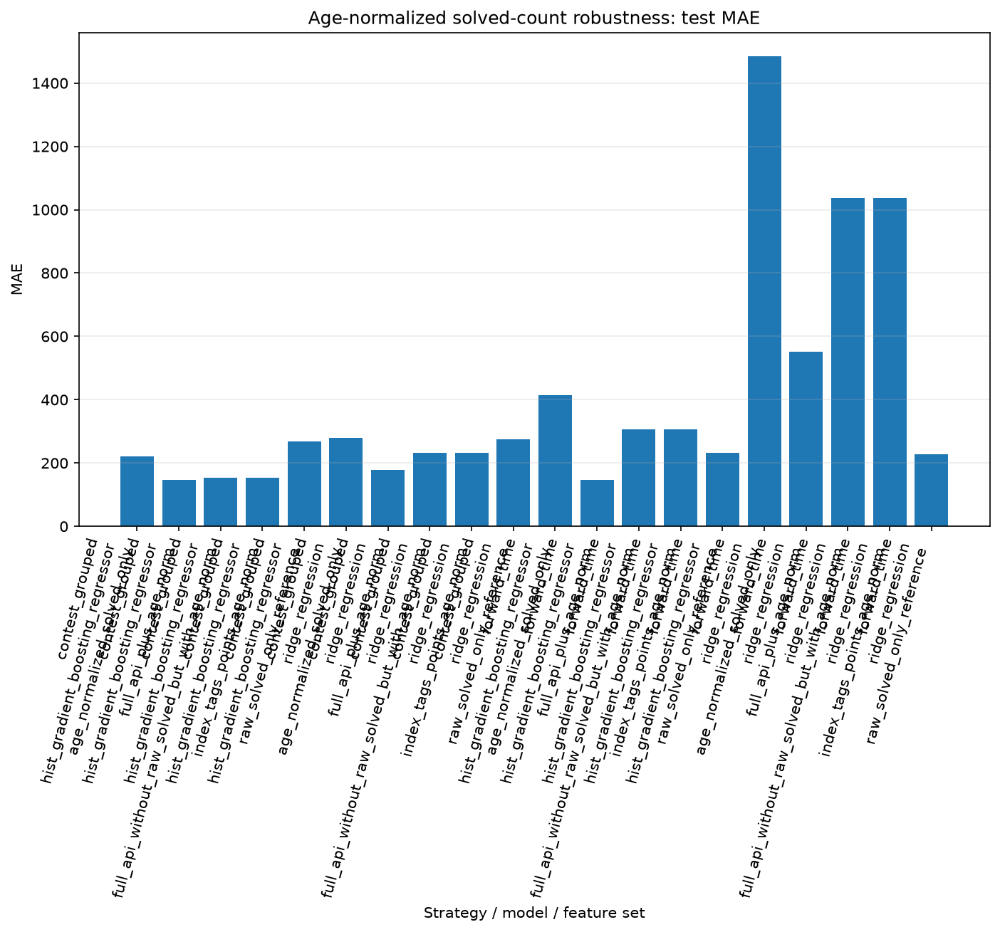
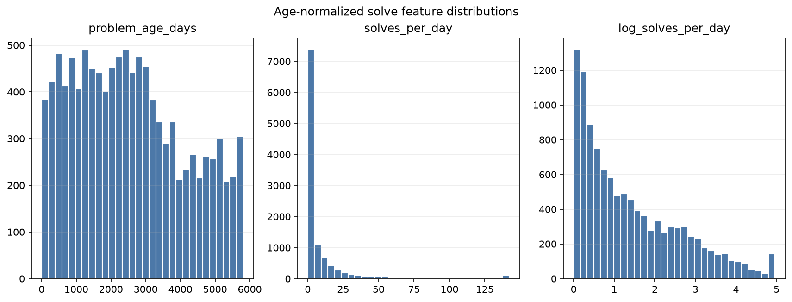
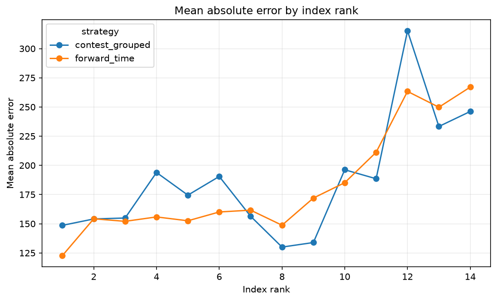

# Abstract

This project studies Codeforces problem-rating prediction from official API metadata and solved-statistics signals. The current dataset contains 10,979 rated programming problems with ratings from 800 to 3500. The strongest simple baseline is solved-count-only in both evaluation settings, and full models further improve over that baseline: `hist_gradient_boosting_regressor` achieved the lowest contest-grouped test MAE in the main baseline results, while `random_forest_regressor` achieved the lowest forward-time test MAE. Ablations indicate that removing solved features causes the largest observed MAE increase among one-group drops. New robustness experiments show a large cold-start gap when solved-count behavior is unavailable, while age-normalized solved-count features provide useful but incomplete exposure adjustment. Overall, the results support solved-statistics as a central public signal, while showing that metadata and tag features remain useful and that cold-start difficulty prediction is substantially harder than post-publication prediction.

# Introduction

Codeforces problem ratings are useful for curriculum design, recommendation, and contest analysis. However, ratings are only available after human and platform processes have assigned difficulty labels. This project asks how well public metadata and submission-behavior summaries can predict official ratings. The study is intentionally restricted to the official public Codeforces API, avoiding scraping, private user data, and problem-statement text. The goal is not to replace official ratings, but to quantify which public signals are predictive and where errors remain.

A key distinction in this version is between post-publication prediction and cold-start prediction. Post-publication prediction can use solved-count statistics observed at snapshot time, whereas cold-start prediction must rely on metadata available before submissions accumulate. This distinction matters because solved-count behavior is highly predictive but is not available at the moment a new problem is released. The paper therefore reports the original model results, feature-group ablations, and a new robustness section that evaluates how much performance changes when solved-count features are removed or normalized by problem age.

# Related Work

Difficulty prediction for programming problems is related to educational data mining, recommender systems, and competitive-programming analytics. In many educational settings, item difficulty is estimated from learner outcomes, item metadata, text, or historical response patterns. Competitive-programming platforms add a distinctive structure: problems are organized by contests, indexed by approximate within-contest difficulty, labeled with tags, and eventually associated with public solve counts. These fields create a lightweight tabular prediction problem that can be studied reproducibly without collecting private participant histories.

This project focuses on structured public metadata rather than semantic understanding of statements or editorials. That design choice makes the pipeline simpler and more reproducible, but it also limits the model to signals such as problem index, tags, point values, contest timing, and aggregate solved counts. The analysis therefore complements richer approaches based on natural-language features or user-level interaction logs. It is best read as a transparent baseline for what official API metadata and public submission aggregates can explain.

# Data

The processed modeling table contains 10,979 rated `PROGRAMMING` problems from 1,948 contests. Ratings range from 800 to 3500. The raw source is the official Codeforces API, specifically `problemset.problems` and `contest.list`. The `problemset.problems` response provides both problem metadata and `problemStatistics`, while `contest.list` provides contest-level metadata such as contest phase and start time.

The main analysis filters to rated programming problems with non-null contest identifiers. Problem fields can be absent in the API, so preprocessing records missingness rather than silently changing the research meaning of the data. Tags are preserved as list-valued data in the interim layer and then encoded as one-hot features in the modeling table. Solved counts are retained because they are publicly available through the API, but they are interpreted cautiously: they reflect intrinsic difficulty, age, popularity, exposure, and participation patterns at the same time.

Solved counts are strongly skewed. In the current dataset, the median solved count is 4,167, the 99th percentile is 73,912, and the maximum is 700,377. This skew motivates both log transformations in the feature table and the later robustness experiment on age-normalized solved counts. The contest-grouped split has zero contest overlap between partitions, and the forward-time split is strictly ordered by contest start time.

See Table `paper/tables/dataset_summary.md` for the compact dataset summary.

# Methods

The feature table preserves problem identifiers, official rating as the target, contest start time, index-derived features, point metadata, solved-count features, and one-hot tag indicators. Index features include the leading problem letter, numeric suffix when present, and an ordinal rank such as A = 1 and B = 2. Point metadata is represented with both a numeric value and a missingness indicator. Solved behavior is represented by raw solved count, a missingness indicator, and `log_solved_count`.

Evaluation uses two complementary split strategies. The contest-grouped split prevents contest leakage by assigning every contest to only one partition. The forward-time split orders contests chronologically to test temporal generalization. The model set in the baseline stage includes simple baselines, ridge regression, random forest, and histogram gradient boosting. The ablation stage evaluates ridge regression and histogram gradient boosting across predefined feature groups.

The robustness experiments add two targeted checks. First, cold-start metadata-only prediction excludes solved-count features and evaluates feature sets built from index, tags, and points. This approximates the setting where a new problem has metadata but not enough submissions for solved behavior to be informative. Second, age-normalized solved-count features compute `problem_age_days`, `solves_per_day`, and `log_solves_per_day` from the snapshot time and contest start time. These features are computed only inside the robustness module and do not alter the existing processed or feature tables.

# Results

On the contest-grouped test split, `hist_gradient_boosting_regressor` achieved the lowest main baseline test MAE (166.9) with within-200 accuracy 0.697. On the forward-time test split, `random_forest_regressor` achieved the lowest main baseline test MAE (152.5) with within-200 accuracy 0.712. Among simple baselines, solved-count-only is strongest in both settings: `solved_count_only_baseline` has MAE 274.4, compared with 409.2 for index-only and 482.9 for tag-only in the contest-grouped setting; in the forward-time setting, solved-count-only has MAE 227.2, compared with 461.2 for index-only and 579.0 for tag-only.

The full models still improve over solved-count-only, indicating that additional metadata contributes beyond solved statistics. The forward-time train/test gaps are interpreted as temporal generalization gaps or distribution shift, not automatic evidence of overfitting. The strongest simple baseline therefore does not eliminate the value of structured metadata; rather, it shows that solved behavior is the central public signal around which the other features add context.

# Ablation Study

The best overall ablation result is `hist_gradient_boosting_regressor` with `all_api_features` on the `forward_time` split, with test MAE 153.0. The one-group drop comparison shows that removing `solved` features produces the largest MAE increase. This supports the central role of solved-count behavior while retaining the usefulness of metadata and tag information.

The ablation results should be interpreted together with the split design. Contest-grouped evaluation tests generalization to held-out contests without leaking contest identity across partitions. Forward-time evaluation is stricter in a different way: it asks whether models trained on earlier contests transfer to later contests. Under both perspectives, solved features remain important, but the robustness section below shows why these features should not be confused with cold-start information.

# Robustness Experiments

The robustness experiments separate two questions that are easy to conflate. The first asks how well the model performs when solved-count behavior is removed, approximating a cold-start scenario. The second asks whether a simple exposure adjustment, solves per day, can make solved-count features more comparable across problems of different ages. Both experiments reuse the existing splits and report test-set performance without changing the main baseline, ablation, or analysis outputs.

## 8.1 Cold-start prediction

Cold-start prediction is substantially harder than post-publication prediction. For `hist_gradient_boosting_regressor`, the metadata-only cold-start feature set has test MAE 317.52 on the contest-grouped split and 331.62 on the forward-time split. In contrast, the full API reference for the same model has test MAE 167.47 on the contest-grouped split and 153.02 on the forward-time split. The resulting cold-start MAE gaps are +150.05 and +178.60, respectively.

These results show that index, tag, and point metadata contain useful information but cannot replace solved-count behavior. The cold-start setting should therefore be presented as a different task rather than as a minor variation of the full API prediction problem. A practical use of the metadata-only model would be preliminary difficulty estimation before enough submissions arrive, not a replacement for post-publication models trained with solved statistics.

See Table `paper/tables/robustness_cold_start.md` for the cold-start comparison.

## 8.2 Age-normalized solved count

The age-normalized experiment uses `solves_per_day` and `log_solves_per_day` to partially adjust for unequal exposure time. For `hist_gradient_boosting_regressor`, age-normalized solved-only features improve over raw solved-only features in the contest-grouped setting: MAE is 221.95 for `age_normalized_solved_only` versus 268.51 for `raw_solved_only_reference`. In the forward-time setting, however, the pattern reverses: `age_normalized_solved_only` has MAE 414.62, while `raw_solved_only_reference` has MAE 231.85.

When age-normalized features are added to the full HGB model, performance improves relative to the original full API reference: `full_api_plus_age_norm` reaches MAE 145.74 on the contest-grouped split and 147.73 on the forward-time split. This suggests that age-normalized solved behavior can add useful information to a flexible full model. At the same time, age normalization does not consistently replace raw solved-count features, and it should not be described as removing solved-count bias. It is a simple proxy for exposure, not a model of nonlinear solve accumulation, platform visibility, participant mix, or changing contest popularity.

See Table `paper/tables/robustness_age_normalized.md` for the age-normalized comparison.

# Error Analysis

Error tables summarize the largest absolute errors and aggregate errors by tag and index rank. These artifacts are intended to identify regions where public metadata is less sufficient, such as unusual special problems or tasks whose solved counts diverge from official rating. The analysis does not claim causal explanations; it provides diagnostic patterns for later qualitative review.

Large errors are especially important in this project because official rating is an ordinal difficulty signal with practical consequences for recommendation and curriculum design. A model that performs well on average may still fail on special problem types, tasks with atypical tags, or problems whose popularity does not match their intrinsic difficulty. The paper therefore treats error analysis as a guardrail against overinterpreting aggregate MAE.

# Limitations

The dataset uses public Codeforces API fields only, so it lacks statement text, editorials, participant-level histories, and temporal details of when solves accumulated. Solved counts are strong predictors but can encode popularity, age, and exposure in addition to intrinsic difficulty. Forward-time evaluation partially addresses temporal generalization, but future snapshots may shift as Codeforces problem styles and participant populations change. The present analysis is best viewed as a reproducible baseline for structured public metadata rather than a final difficulty model.

True cold-start prediction remains difficult because solved behavior is unavailable before submissions accumulate. The cold-start robustness results show a large performance gap between metadata-only features and full API features. This gap is not a defect of the experiment; it is evidence that post-publication solved statistics carry information that is not present in tags, index position, or points alone.

Age-normalized solved count is also only a simple proxy. Dividing solves by elapsed days cannot fully model nonlinear solve accumulation over time, contest visibility, archival discovery, educational reuse, or shifts in the active Codeforces population. The age-normalized results should therefore be interpreted as a useful robustness check, not as a complete correction for exposure bias.

# Conclusion

Across 10,979 rated programming problems, official API metadata and solved statistics support accurate rating prediction. Solved-count-only is the strongest simple baseline, yet full models improve over it, and ablations show that solved features are the most important group among the tested public signals. The robustness experiments strengthen the paper by separating post-publication prediction from cold-start prediction and by showing that age-normalized solved-count features are useful but incomplete. The resulting artifacts provide a reproducible foundation for future work on richer textual, temporal, and contest-context features.

# References

- Codeforces public API documentation and public API responses used by this project.
- Project-generated reproducibility artifacts under `outputs/`.
- The modeling and analysis pipeline uses pandas, pyarrow, matplotlib, and scikit-learn.
