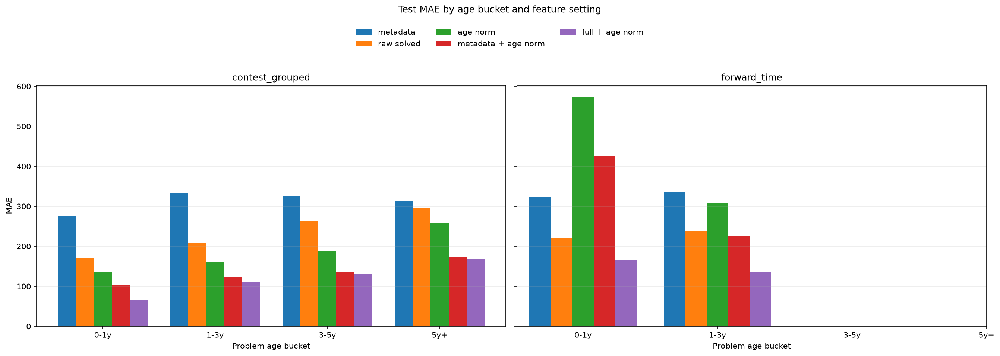
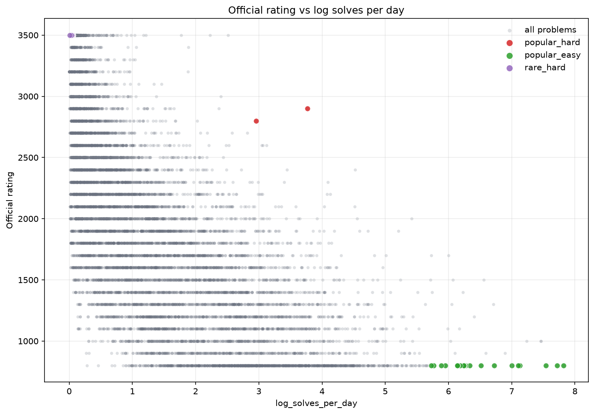
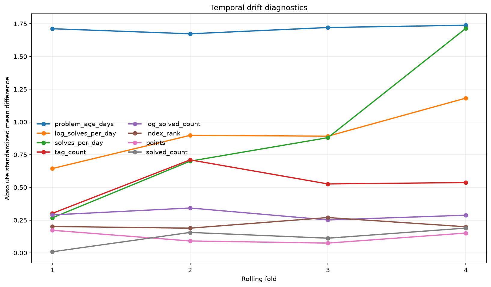

# Predicting Codeforces Problem Difficulty from Public API Metadata, Solved Statistics, and Exposure Signals

## Abstract

Competitive programming platforms contain thousands of algorithmic problems, but difficulty labels are not always available when a new problem is created, selected for practice, or used in a learning sequence. This project studies whether Codeforces problem ratings can be predicted from structured public information available through the official Codeforces API. The study intentionally avoids problem-statement scraping and private user data. It uses an API-only dataset of 10,979 rated programming problems from 1,948 contests, with official ratings ranging from 800 to 3500. The feature set includes problem index features, point metadata, algorithm tags, solved counts, and contest timing used for evaluation. The main results show that solved-count-only is the strongest simple baseline, while full models improve further under contest-grouped and forward-time evaluation. Robustness experiments show that metadata-only cold-start prediction is substantially harder than post-publication prediction, and that age-normalized solved-count features provide useful but incomplete exposure adjustment. Additional exposure-aware analysis shows that solved behavior varies across problem age groups and reveals popularity-difficulty mismatch cases. Rolling-window temporal validation over four chronological folds further shows that full API features plus age-normalized exposure features achieve the best average MAE across folds. Overall, the project should be read as a reproducible study of public metadata, solved behavior, exposure effects, cold-start limits, and temporal stability, rather than as a final model of intrinsic algorithmic difficulty.

## 1. Introduction

Competitive programming is a common way for students and software developers to practice algorithmic problem solving. On platforms such as Codeforces, problems are organized by contests, indexed by contest position, assigned algorithmic tags, and eventually associated with official difficulty ratings. These ratings are useful because they give learners a rough map of what problems are appropriate for their current skill level. For example, a beginner may want to avoid problems that require advanced graph theory, while an experienced contestant may want recommendations that are just above their current comfort zone. In this setting, difficulty prediction is not only a modeling problem; it is also connected to curriculum design, recommendation, practice planning, and contest analysis.

This project focuses on a constrained version of the problem: predicting Codeforces official problem ratings using only structured public data from the official Codeforces API. The choice of an API-only setting is deliberate. Many competitive programming datasets can be built by scraping problem statements, editorials, or submissions, but such pipelines are harder to reproduce and can create additional data-governance questions. The official API gives a cleaner and more stable starting point. In particular, the `problemset.problems` method returns Codeforces `Problem` and `ProblemStatistics` objects, while `contest.list` returns contest metadata. The API documentation states that `problemset.problems` returns all problems from the problemset together with problem statistics, and that `contest.list` returns available contest information [@codeforces_api_methods]. The `Problem` and `ProblemStatistics` return-object documentation identifies the kinds of structured fields that can be used in an API-only study, while the `Contest` object includes contest start-time information that supports time-based evaluation [@codeforces_api_objects].

A further distinction is between post-publication prediction and cold-start prediction. In the main setting, solved-count statistics are observed at snapshot time, after problems have had time to accumulate submissions. In a cold-start setting, a new problem has metadata such as index, tags, and point value, but little or no solved behavior. Because solved count is a powerful signal, this distinction is central to interpreting the results.

The central research question is: how much of Codeforces problem rating can be predicted from public metadata and solved statistics, and how much do exposure effects shape those signals? This broad question is divided into five more specific questions. First, how strong are simple public signals such as problem index, algorithm tags, and solved count? Second, do full machine-learning models improve substantially over the best simple baseline? Third, which feature groups matter most when they are removed from the full feature set? Fourth, how much performance is lost when solved-count behavior is unavailable in a cold-start setting? Fifth, how stable are these results across problem age groups and chronological rolling-window validation?

The project uses two evaluation protocols because a single random split would be too optimistic. Problems from the same contest may be stylistically related, share authors, or follow similar difficulty progression. If problems from a contest were placed in both training and testing sets, a model could benefit from contest-specific patterns that would not be available for a new contest. The contest-grouped split avoids this by assigning all problems from the same contest to the same partition. The second protocol is a forward-time split, where older contests are used for training and newer contests for validation and testing. This is closer to deployment: a difficulty-prediction system would often be asked to predict difficulty for future problems, not for randomly held-out problems from the same historical period. This design also connects to the broader machine-learning literature on distribution shift, where performance can change when the test distribution differs from the training distribution [@koh2021wilds; @yao2022wildtime].

The main empirical finding is that solved count is a much stronger simple signal than either problem index or algorithm tags alone. Under contest-grouped evaluation, solved-count-only reaches test MAE 274.4, compared with 409.2 for index-only and 482.9 for tag-only. Under forward-time evaluation, solved-count-only reaches test MAE 227.2, compared with 461.2 for index-only and 579.0 for tag-only. This result should not be interpreted as meaning that solved count measures intrinsic difficulty perfectly. Solved count is confounded by age, popularity, visibility, contest format, and how long a problem has been available. However, it is strongly predictive of the rating label in this snapshot.

At the same time, full models still improve over solved-count-only. In the contest-grouped setting, the best full model reduces MAE from 274.4 to 166.9, an absolute improvement of 107.5 rating points. In the forward-time setting, the best full model reduces MAE from 227.2 to 152.5, an absolute improvement of 74.7 rating points. Ablation experiments reinforce the same conclusion: removing solved features causes the largest increase in test MAE among one-group feature removals, while removing tags, index features, or point features has smaller effects. Therefore, solved statistics are the dominant structured signal, but the remaining metadata is not useless.

This paper makes six contributions. First, it provides a reproducible API-only pipeline for Codeforces rating prediction. Second, it compares simple baselines and full models under contest-grouped and forward-time evaluation. Third, it performs ablation studies that quantify the predictive contribution of index, solved, tag, and point features. Fourth, it separates post-publication prediction from metadata-only cold-start prediction. Fifth, it adds exposure-aware analyses of age buckets and popularity-difficulty mismatch examples. Sixth, it adds rolling-window temporal validation and simple drift diagnostics. The result is not a final difficulty model, but a stronger auditable baseline for future work that may add problem statements, temporal solve trajectories, or richer contest context.

## 2. Related Work

This project sits between educational data mining, competitive programming analytics, and machine-learning evaluation under distribution shift. Educational data mining studies how data generated in learning environments can be used to understand and support learning. Romero and Ventura describe educational data mining as a field that applies data-mining methods to educational data, including prediction, visualization, feedback, and recommendation tasks [@romero2010edm]. Difficulty prediction is closely related to this tradition because the goal is to estimate how demanding an item is for learners or contestants. In classical educational measurement, item response theory models item difficulty through response patterns, often treating item difficulty and learner ability as latent quantities [@rasch1960probabilistic]. This project is not an IRT model because it does not use individual-level response histories. However, it shares the basic idea that observed solving behavior contains information about problem difficulty.

There is also more direct work on competitive programming problems. Kim, Cho, and Na proposed a dataset and method for predicting algorithm tags and difficulty levels for competitive programming problems, mainly collecting samples from Codeforces [@kim2023psg]. Their work treats tag and difficulty prediction as a problem involving problem text and multi-task modeling. The present project differs in two ways. First, it restricts itself to API metadata and solved statistics rather than using full problem statements. Second, it emphasizes leakage-aware and forward-time evaluation with simple, interpretable baselines. This makes the project less powerful in terms of input information, but more reproducible and easier to audit.

Competitive programming datasets also appear in code-generation benchmarks. The APPS benchmark introduced 10,000 programming problems for evaluating whether models can generate Python solutions from natural-language specifications [@hendrycks2021apps]. More recent competitive-programming benchmarks continue to use problem ratings, tags, and online judge results as ways to measure model capability. These works are useful background because they show that competitive programming problems are valuable evaluation objects. However, the task in this project is different. APPS-like benchmarks evaluate whether a system can solve a problem; this project predicts the official difficulty rating of the problem from structured public features.

The methodology also connects to robust evaluation. In many machine-learning applications, random splits can make a system appear stronger than it would be in deployment. Distribution-shift benchmarks such as WILDS emphasize that models can perform worse when tested on groups or domains that differ from the training distribution [@koh2021wilds]. Wild-Time focuses specifically on temporal shift, where training and test examples differ because time has passed [@yao2022wildtime]. These ideas motivate the two evaluation protocols used here. The contest-grouped split reduces contest-level leakage, while the forward-time split estimates how well models generalize from older contests to newer contests. This is especially important because Codeforces problem styles and participation patterns can change over time.

Finally, the model choices are standard structured-data regressors rather than large language models. Ridge regression provides a regularized linear baseline [@hoerl1970ridge]. Random forests aggregate decision trees and can capture nonlinear interactions [@breiman2001rf]. Gradient boosting builds an additive model of weak learners and is often strong for tabular data [@friedman2001gbm]. The purpose of this model set is not to claim state-of-the-art performance. Instead, the models give a reasonable spectrum from linear to nonlinear methods, allowing the study to focus on features, evaluation, and interpretation.

## 3. Data

The raw data was collected from the official Codeforces API. The acquisition script fetched two resources: `problemset.problems` and `contest.list`. The `problemset.problems` endpoint provides a list of problems and a corresponding list of problem statistics. The `contest.list` endpoint provides contest-level metadata. The raw snapshot used in this project contained 11,255 problem records, 11,255 problem-statistics records, and 2,126 contest records. Each raw response was saved with a timestamp, byte count, request URL, and SHA-256 hash, so that later preprocessing steps could be traced back to a specific snapshot.

The preprocessing stage normalized the raw JSON into separate tables for problems, problem statistics, and contests. These tables were then merged by problem identifiers and contest identifiers. The modeling dataset retained only rated `PROGRAMMING` problems with non-missing contest identifiers, problem indices, official ratings, solved counts, and contest start times. This removed 276 unrated problems and produced 10,979 rated programming problems. The final processed table contains problems from 1,948 contests. Official ratings range from 800 to 3500, with mean 1866.9 and median 1800. These values show that the dataset covers a broad portion of the Codeforces rating scale rather than a narrow band of easy or hard problems.

The most important behavioral variable is solved count. Solved count is available through the Codeforces problem statistics object and records how many accepted solutions have accumulated for a problem. Its distribution is highly skewed. The median is 4,167, the 75th percentile is 13,659.5, the 90th percentile is 25,146.8, the 95th percentile is 33,251.6, and the 99th percentile is 73,912.3. The maximum is 700,377. This long tail explains why a standard linear histogram is not very informative. The final EDA therefore includes both a log-transformed solved-count histogram and a p99-clipped view. These figures make the main distribution visible without ignoring extreme outliers.

Tags are another major part of the data. The most frequent tags are `greedy` (3,485 problems), `math` (3,406), `implementation` (2,987), `dp` (2,476), `constructive algorithms` (2,062), `data structures` (1,998), `brute force` (1,956), `binary search` (1,274), `sortings` (1,223), and `graphs` (1,194). These tags are useful because they describe algorithmic topic areas, but they are also imperfect. A tag may summarize a solution technique rather than intrinsic difficulty, and some problems have multiple tags or no common tags. For this reason, tags are treated as one feature group rather than as a definitive difficulty explanation.

Two evaluation splits were created. The first is the contest-grouped split. It assigns all problems from the same contest to the same partition, producing 7,650 training problems, 1,674 validation problems, and 1,655 test problems. The contest overlap between train, validation, and test is zero. This design is important because problems from the same contest often share context, authorship, and difficulty progression. If a model saw one problem from a contest during training and another from the same contest during testing, the evaluation could overestimate generalization.

The second evaluation protocol is the forward-time split. It sorts contests by `start_time_seconds`, trains on earlier contests, validates on later contests, and tests on the newest contests in the snapshot. This split contains 7,375 training problems, 1,728 validation problems, and 1,876 test problems. The time ranges are strictly ordered. This design is more realistic for future-problem prediction, but it also introduces temporal distribution shift: newer contests may differ from older contests in style, audience, or rating behavior. For this reason, performance gaps in this setting should be interpreted as temporal generalization behavior rather than automatic evidence of overfitting.

## 4. Methods

The prediction target is the official Codeforces problem rating. The model is given structured features for each problem and outputs a continuous rating prediction. The task is therefore treated as regression. Classification into difficulty bands could be added later, but regression preserves the ordinal and interval-like structure of the rating scale and makes errors easy to interpret in rating points.

The feature table has 51 columns in total, including identifiers and target columns. The modeling feature list contains 46 features. These features are divided into four groups. The first group is index features. Codeforces problem indices such as A, B, C, D, or E often reflect intended contest order. The feature pipeline converts the index into `index_letter`, `index_number`, and `index_rank`. These features are expected to contain useful contest-design information, but they are not a complete difficulty measure because different contests have different divisions and formats.

The second group is solved features: `solved_count`, `solved_count_missing`, and `log_solved_count`. The log-transformed count is included because the raw solved-count distribution is extremely skewed. Solved count is expected to be highly predictive because easier and more popular problems tend to accumulate more accepted solutions. However, it is also the most conceptually risky feature. It can encode exposure, age, and popularity in addition to difficulty. This project therefore treats it both as a strong baseline and as a feature group to test carefully through ablation.

The third group is tag features. The feature pipeline includes `tag_count` and one-hot indicators for tags that meet a minimum frequency threshold. There are 37 tag one-hot features. Tags provide topic-level information, such as whether a problem involves dynamic programming, graph algorithms, greedy construction, or number theory. They are useful for interpretability but may not be sufficient by themselves because many tags appear across a wide range of ratings.

The fourth group is point metadata: `has_points` and `points`. Many Codeforces problems have missing point values, so the pipeline uses zero imputation together with a missingness indicator. The number of missing point values before imputation is 3,658. This feature group is not expected to dominate prediction, but it may provide useful contest-format context for problems where point values are available.

The main model stage includes simple baselines and standard regressors. The mean baseline predicts the training-set mean rating. The index-only baseline uses only index features. The tag-only baseline uses tag features. The solved-count-only baseline uses solved-count features. The full models are ridge regression, random forest regression, and histogram gradient boosting regression. Ridge regression is a regularized linear model and gives a useful lower-complexity comparison. Random forest and histogram gradient boosting provide nonlinear models that can capture feature interactions.

The robustness experiments add two targeted checks. The first is a cold-start metadata-only setting that excludes solved-count features and uses only index, tags, and point metadata. This approximates prediction before enough submissions have accumulated to make solved behavior informative. The second constructs simple age-normalized solved-count features. The snapshot time is compared with each contest start time to compute problem_age_days, solves_per_day, and log_solves_per_day. These features are used only inside the robustness module and do not overwrite the original processed or feature tables. They are intended as a partial exposure adjustment, not as a complete correction for solved-count bias.

The exposure-aware analysis extends this idea without changing the main feature table. It groups problems into age buckets of 0-1 years, 1-3 years, 3-5 years, and 5 years or more. It compares metadata-only, raw solved-only, age-normalized solved-only, metadata plus age-normalized exposure, and full API plus age-normalized exposure feature settings within those buckets. It also identifies popularity-difficulty mismatch examples using quantile thresholds on official rating and log solves per day. These examples are used as diagnostics, not as causal proof that a problem is popular or underexposed for a specific reason.

The temporal-validation module adds expanding-window chronological validation. Contests are sorted by start time, and four folds are constructed so that each fold trains on an earlier block of contests and tests on the next chronological block. The fold design avoids contest overlap between train and test and prevents future contests from entering training. The same module computes simple drift diagnostics by comparing train and test distributions for numeric fields such as rating, solved count, problem age, solves per day, tag count, index rank, and points.

The evaluation metrics are mean absolute error (MAE), root mean squared error (RMSE), coefficient of determination (R²), within-100 accuracy, and within-200 accuracy. MAE is the main metric because it directly measures average error in Codeforces rating points. RMSE gives more weight to large errors. R² measures explained variance relative to a mean predictor. Within-100 and within-200 accuracy measure the share of predictions that fall within a practically meaningful rating window. In Codeforces terms, a 200-point error can often correspond to a meaningful but not catastrophic difficulty mismatch.

Ablation experiments evaluate feature-group contribution. The ablation module trains ridge regression and histogram gradient boosting across several feature sets: index-only, solved-only, tags-only, index plus tags, index plus solved, tags plus solved, index-tags-solved, all API features, all without index, all without solved, all without tags, and all without points. The one-group-drop comparisons are especially important because they test how much performance changes when one feature group is removed from the complete feature set. These experiments do not prove causality, but they quantify predictive dependence on each group.

All experiments use fixed random seeds and saved split files. This is essential because changes in contest assignment or model randomness could otherwise change the reported scores. The pipeline also saves logs, metrics tables, predictions, and paper-ready artifacts. Reproducibility is treated as part of the method rather than as an afterthought.

## 5. Results

Table 1 summarizes the test-set model ranking under both evaluation protocols. The contest-grouped setting and the forward-time setting produce similar broad patterns but differ in which full model is best.

**Table 1. Test-set model ranking by MAE.**

| Strategy | Model | MAE | RMSE | R² | Within 100 | Within 200 |
|---|---:|---:|---:|---:|---:|---:|
| contest-grouped | histogram gradient boosting | 166.9 | 229.1 | 0.901 | 0.428 | 0.697 |
| contest-grouped | random forest | 176.0 | 246.8 | 0.885 | 0.417 | 0.669 |
| contest-grouped | ridge regression | 189.5 | 249.3 | 0.883 | 0.337 | 0.630 |
| contest-grouped | solved-count-only | 274.4 | 357.6 | 0.759 | 0.213 | 0.439 |
| contest-grouped | index-only | 409.2 | 519.8 | 0.490 | 0.143 | 0.283 |
| contest-grouped | tag-only | 482.9 | 607.4 | 0.304 | 0.133 | 0.262 |
| contest-grouped | mean | 606.5 | 728.4 | -0.001 | 0.100 | 0.193 |
| forward-time | random forest | 152.5 | 195.8 | 0.943 | 0.433 | 0.712 |
| forward-time | histogram gradient boosting | 152.8 | 193.8 | 0.944 | 0.391 | 0.713 |
| forward-time | ridge regression | 179.8 | 226.9 | 0.923 | 0.327 | 0.639 |
| forward-time | solved-count-only | 227.2 | 281.8 | 0.882 | 0.235 | 0.494 |
| forward-time | index-only | 461.2 | 550.4 | 0.549 | 0.086 | 0.180 |
| forward-time | tag-only | 579.0 | 700.9 | 0.269 | 0.088 | 0.192 |
| forward-time | mean | 697.8 | 819.8 | 0.000 | 0.085 | 0.160 |

In the contest-grouped split, the best model is histogram gradient boosting, with MAE 166.9, RMSE 229.1, and R² 0.901. It places 42.8% of predictions within 100 rating points and 69.7% within 200 rating points. Random forest is second with MAE 176.0, and ridge regression is third with MAE 189.5. The ordering suggests that nonlinear models help, but the linear model is also competitive once all structured features are included.

In the forward-time split, random forest and histogram gradient boosting are nearly tied. Random forest has slightly lower MAE at 152.5, while histogram gradient boosting has slightly lower RMSE at 193.8 and slightly higher R² at 0.944. Both models place about 71% of test predictions within 200 rating points. Because the MAE difference between these two models is only about 0.24 rating points, the safer interpretation is that both nonlinear full models perform similarly under forward-time evaluation.

The simple baselines reveal the most important empirical pattern. Solved-count-only is the strongest simple baseline in both evaluation settings. In the contest-grouped split, solved-count-only has MAE 274.4, while index-only has MAE 409.2 and tag-only has MAE 482.9. In the forward-time split, solved-count-only has MAE 227.2, while index-only has MAE 461.2 and tag-only has MAE 579.0. This means solved-count-only is not merely a small improvement over mean prediction; it is a major baseline that any full model must beat.

The full models do beat this baseline. In contest-grouped evaluation, histogram gradient boosting improves over solved-count-only by 107.5 MAE points, a 39.2% reduction relative to the solved-count-only MAE. It improves over index-only by 242.3 points and over tag-only by 316.0 points. In forward-time evaluation, random forest improves over solved-count-only by 74.7 points, a 32.9% reduction. It improves over index-only by 308.7 points and over tag-only by 426.5 points. These improvements show that while solved count is dominant, combining it with index, tag, and point metadata produces a better predictor.

The train-test gap analysis requires careful interpretation. In the contest-grouped split, random forest has train MAE 85.3 and test MAE 176.0, producing a large gap that suggests possible overfitting. Histogram gradient boosting has a smaller gap, with train MAE 137.2 and test MAE 166.9. In the forward-time split, larger train-test gaps should not automatically be called overfitting because the test set is newer by design. A gap in this setting may reflect temporal distribution shift, changes in problem styles, or changes in participation patterns. The analysis summary therefore describes these as temporal generalization gaps.

Overall, the results support three conclusions. First, structured public API data is sufficient for fairly accurate rating prediction. Second, solved statistics are the strongest simple signal. Third, full models still add value beyond solved count, suggesting that metadata and tags contain complementary information.

## 6. Ablation Study

The ablation study asks which feature groups matter most when models are forced to use subsets of the available API features. The main one-group-drop experiments compare `all_api_features` against versions that remove index, solved, tag, or point features. The ablation stage uses ridge regression and histogram gradient boosting under both contest-grouped and forward-time evaluation.

The best feature set for every tested strategy-model pair is `all_api_features`. For histogram gradient boosting, `all_api_features` gives MAE 167.5 in the contest-grouped split and 153.0 in the forward-time split. For ridge regression, it gives MAE 189.5 in the contest-grouped split and 179.8 in the forward-time split. This indicates that none of the tested feature groups is entirely harmful in the full configuration. Even when a group has a smaller contribution, the model generally benefits from retaining all public API features.

The most important ablation result is the effect of removing solved features. In the contest-grouped split, removing solved features from histogram gradient boosting increases MAE from 167.5 to 317.5, a difference of 150.1 points and an 89.6% increase. For ridge regression in the same split, removing solved features increases MAE from 189.5 to 340.5, a difference of 151.0 points and a 79.7% increase. The pattern is even stronger in forward-time evaluation. For histogram gradient boosting, removing solved features increases MAE from 153.0 to 331.6, a difference of 178.6 points and a 116.7% increase. For ridge regression, removing solved features increases MAE from 179.8 to 365.3, a difference of 185.5 points and a 103.1% increase.

Removing tags also hurts performance, but less than removing solved features. In contest-grouped histogram gradient boosting, removing tags increases MAE by 31.3 points. In forward-time histogram gradient boosting, removing tags increases MAE by 15.7 points. Ridge regression shows a similar but smaller pattern in the forward-time split, where removing tags increases MAE by only 3.6 points. This suggests that tags are useful but not dominant. They may help explain algorithmic topic differences, but they do not replace solved-count information.

Removing index features has a smaller effect than removing tags or solved features. For histogram gradient boosting, removing index features increases MAE by 8.9 points in contest-grouped evaluation and 8.5 points in forward-time evaluation. For ridge regression, the corresponding increases are 11.6 and 15.6 points. This result is important because problem index is an intuitive proxy for difficulty, but in the full model it is not the main source of predictive power.

Point metadata has mixed but nonzero contribution. In contest-grouped histogram gradient boosting, removing points increases MAE by 9.0 points. In forward-time histogram gradient boosting, removing points increases MAE by 18.2 points. Because points are missing for many problems, this feature group should not be overinterpreted, but the missingness-aware encoding appears to provide some useful contest-format information.

The ablation study strengthens the main results. Solved features are the largest contributor among the tested groups, tags and points provide additional signal, and index features provide a smaller but still measurable contribution. These are predictive contributions, not causal claims. Removing solved features does not prove that solve count causes difficulty; it shows that the trained models rely heavily on solved-count-derived information to predict official rating.

## 7. Robustness Experiments

The main results show that solved-count features are highly predictive. This is useful, but it also creates two concerns. First, solved-count behavior is not available at the moment a new problem is released, so the full API model should be interpreted as a post-publication predictor rather than a cold-start predictor. Second, cumulative solved count is affected by exposure time: older problems naturally have more time to collect accepted submissions. The robustness experiments address these concerns without changing the main pipeline or previously reported results.

### 7.1 Cold-start prediction

Cold-start prediction is substantially harder than post-publication prediction. For histogram gradient boosting, the metadata-only cold-start feature set has test MAE 317.52 on the contest-grouped split and 331.62 on the forward-time split. In contrast, the full API reference for the same model has test MAE 167.47 on the contest-grouped split and 153.02 on the forward-time split. The resulting cold-start MAE gaps are +150.05 and +178.60 rating points, respectively.

These results show that index, tag, and point metadata contain useful information but cannot replace solved-count behavior. The cold-start setting should therefore be presented as a different task rather than as a minor variation of the full API prediction problem. A practical use of the metadata-only model would be preliminary difficulty estimation before enough submissions arrive, not a replacement for post-publication models trained with solved statistics.

### 7.2 Age-normalized solved count

The age-normalized experiment uses solves_per_day and log_solves_per_day to partially adjust for unequal exposure time. For histogram gradient boosting, age-normalized solved-only features improve over raw solved-only features in the contest-grouped setting: MAE is 221.95 for age_normalized_solved_only versus 268.51 for raw_solved_only_reference. In the forward-time setting, however, the pattern reverses: age_normalized_solved_only has MAE 414.62, while raw_solved_only_reference has MAE 231.85.

When age-normalized features are added to the full HGB model, performance improves relative to the original full API reference: full_api_plus_age_norm reaches MAE 145.74 on the contest-grouped split and 147.73 on the forward-time split. This suggests that age-normalized solved behavior can add useful information to a flexible full model. At the same time, age normalization does not consistently replace raw solved-count features, and it should not be described as removing solved-count bias. It is a simple proxy for exposure, not a model of nonlinear solve accumulation, platform visibility, participant mix, or changing contest popularity.

## 8. Exposure-Aware Analysis

The robustness section showed that age-normalized solved-count features can improve the full HGB model, but a single global comparison does not show how exposure behaves across different problem ages. The exposure-aware analysis therefore studies solved behavior as an imperfect signal that mixes difficulty with age, visibility, popularity, and archival reuse. The goal is not to remove all exposure bias, but to make the limitation measurable.

### 8.1 Age-bucket analysis

The processed dataset contains 748 problems aged 0-1 years, 1,684 aged 1-3 years, 1,673 aged 3-5 years, and 6,874 aged 5 years or more at the snapshot time. The age-bucket experiment compares five HGB feature settings inside held-out test rows: metadata-only, raw solved-only, age-normalized solved-only, metadata plus age-normalized solved features, and full API plus age-normalized solved features. Under contest-grouped evaluation, `full_api_plus_age_norm` has the best mean age-bucket MAE, about 118.50. This supports the earlier robustness result: age-normalized exposure features are useful when added to the full feature set.

The forward-time panel should be interpreted carefully. Because the forward-time test set contains the newest contests, only recent age buckets appear there. This is expected rather than a plotting error. The result reinforces the need to distinguish chronological evaluation from age-stratified evaluation. Forward-time testing asks whether older training contests transfer to newer contests, while age-bucket testing asks whether feature behavior changes across different exposure histories.

### 8.2 Popularity-difficulty mismatch

A second exposure-aware analysis identifies examples where official rating and age-normalized popularity do not align cleanly. The popularity signal is `log_solves_per_day`, and the groups are selected using strict 15th and 85th percentile thresholds for rating and normalized popularity. Under these thresholds, the analysis selects 20 popular-easy examples, 2 popular-hard examples, 20 rare-hard examples, and no underexposed-easy examples. The absence of underexposed-easy examples under this strict definition suggests that very easy rated problems are rarely among the lowest age-normalized popularity cases in this snapshot, although this should not be treated as a causal claim.

The mismatch examples make the solved-count limitation more concrete. A hard problem with high solves per day may be a classic training problem, a widely discussed problem, or a problem from a very visible contest. A hard problem with low solves per day may be difficult and also less exposed. These explanations are plausible but not proven by the current data because the analysis does not include submission-level time series, educational lists, or manual statement review. The main value of this section is diagnostic: it shows where solved behavior and official rating should not be treated as identical.

## 9. Rolling Temporal Validation

The forward-time split is more realistic than a random split, but it is still a single chronological split. A single split can hide whether model performance is stable over several time periods. The temporal-validation module therefore adds an expanding-window rolling evaluation over four chronological folds. In each fold, the model trains on earlier contests and tests on the next block of contests, with no contest overlap and no future contests in training.

### 9.1 Expanding-window validation

Across the four rolling folds, `full_api_plus_age_norm` has the best average MAE at about 146.01. The original full API setting has average MAE about 166.66, raw solved-only has average MAE about 285.74, and metadata-only has average MAE about 322.09. Thus, metadata-only prediction remains much worse than full API prediction across rolling chronological evaluation, while adding age-normalized exposure features to the full API setting improves average performance.

This result is important because it directly addresses temporal stability. The improvement from `full_api` to `full_api_plus_age_norm` is not only visible in a single forward-time split; it also appears across multiple chronological folds. However, the result should still be interpreted conservatively. Rolling-window validation is a stronger check than one time split, but it does not prove future performance on all later Codeforces data. The platform, contest formats, and participant population may continue to change.

### 9.2 Temporal drift diagnostics

The drift diagnostics compare train and test distributions for selected numeric fields in each fold. The standardized mean-difference plot shows that problem age has the largest consistent shift, which is expected because each test fold is chronologically later than the training window. Solves per day and log solves per day also shift across folds, while points, index rank, and log solved count show smaller changes. These diagnostics help explain why temporal validation matters: the test periods are not simply random samples from the same distribution.

The drift results are descriptive rather than causal. They show that the data distribution changes over time, but they do not identify the exact source of those changes. A stronger future study could use time-indexed snapshots of solve accumulation, rolling retraining, or explicit concept-drift tests. For the present project, the rolling-window results are sufficient to show that the main conclusions do not depend only on one arbitrary forward-time split.

## 10. Error Analysis

The error analysis examines cases where the best models make large mistakes and aggregates errors by tag and index rank. This section is diagnostic rather than causal. Its purpose is to identify where API-only structured features appear insufficient.

The largest contest-grouped errors include several unusual problems from contest 207 with names such as “The Beaver's Problem - 3.” These cases have low solved counts and no tags in the processed data, yet the model predicts much higher ratings than the official labels for several variants. Another large error is contest 1387 B2, “Village (Maximum),” where the official rating is 2500 but the model predicts about 1431.1. This problem has tags `dfs and similar`, `*special`, and `trees`, with solved count 1297. Another case is contest 1773 F, “Football,” where the official rating is 800 but the model predicts about 1843.0. These examples show that structured features may fail when a problem has unusual labeling, unusual contest context, or solved-count patterns that do not align with official rating.

Tag-level aggregation gives another view. In contest-grouped evaluation, among tags with at least 30 test problems, `*special` has the highest mean absolute error at about 239.0 across 41 problems. Geometry, DFS/tree-related tags, probabilities, graphs, and shortest paths also appear among higher-error tags. This does not prove that those topics are inherently harder to predict. Some tags are rarer, broader, or more heterogeneous than others. For example, a `geometry` tag can cover a wide range of implementation and insight requirements, while `*special` explicitly marks unusual problems. Therefore, tag-level error should be interpreted as a diagnostic signal for manual review.

Index-rank error is also informative. In the contest-grouped split, mean absolute error is lower for early indices such as ranks 1 to 3 and tends to rise for some later ranks, although the relationship is noisy because there are fewer high-rank problems. This makes intuitive sense: later problems may be more diverse and may involve specialized techniques. However, the counts for high index ranks are much smaller, so their estimated error rates are less stable.

The most important conclusion from error analysis is that API-only metadata cannot fully represent problem content. Two problems can share similar tags and solved counts while differing greatly in statement complexity, trickiness, implementation burden, or hidden mathematical insight. Conversely, a problem may have a low official rating but relatively few solves because it is less visible or newer. These limitations explain why even the best models still have large outlier errors.

## 11. Limitations

The most important limitation is the API-only scope. This design improves reproducibility and avoids scraping, but it excludes problem statements, examples, editorials, constraints, and natural-language descriptions. Many aspects of difficulty are textual or semantic. A problem may be hard because the key insight is hidden in the statement, because the implementation is delicate, or because constraints require a non-obvious optimization. None of these factors is directly represented in the current feature set.

The second limitation is solved-count confounding. Solved count is strongly predictive, but it does not measure intrinsic difficulty alone. It also reflects how long a problem has existed, how visible it is, how often it appears in practice lists, whether it belongs to a popular contest, and whether its tags make it attractive for training. The log transform reduces skew but does not remove these conceptual confounds. Because solved count is the dominant signal, the model may partly learn exposure patterns rather than pure difficulty.

Third, the project uses a single snapshot. Codeforces is a living platform. New contests are added, problem ratings can change, and solved counts continue to accumulate. A model trained on one snapshot may perform differently on a later snapshot. The reproducibility record allows the current pipeline to be rerun, but independent reproduction on a later date may yield different numbers.

Fourth, the forward-time split only approximates future deployment. It trains on older contests and tests on newer contests, which is more realistic than a random split. However, the current features still include solved counts from the snapshot rather than solved counts available immediately after contest publication. This means the forward-time experiment tests temporal generalization across problem cohorts, but it does not fully simulate a cold-start setting where no post-publication solve statistics exist. A stronger future design would include time-indexed solved-count snapshots.

Fifth, the rating label itself is treated as ground truth. Codeforces ratings are useful and widely understood, but they are still platform-specific labels. They may reflect community behavior, contest divisions, and post-contest adjustments. A prediction error does not always mean the model is objectively wrong; it means the prediction differs from the platform's rating label.

Finally, the error analysis is limited. It identifies high-error cases and aggregates by tags and index rank, but it does not manually inspect problem statements. Without qualitative review, the project cannot determine exactly why a problem is mispredicted. The current error analysis should therefore be treated as a guide for future inspection rather than a complete explanation.

True cold-start prediction remains difficult because solved behavior is unavailable before submissions accumulate. The robustness results show a large performance gap between metadata-only features and full API features. This gap is not a defect of the experiment; it is evidence that post-publication solved statistics carry information that is not present in tags, index position, or points alone.

Age-normalized solved count is also only a simple proxy. Dividing solves by elapsed days cannot fully model nonlinear solve accumulation over time, contest visibility, archival discovery, educational reuse, or shifts in the active Codeforces population. The age-normalized results should therefore be interpreted as a useful robustness check, not as a complete correction for exposure bias.

The exposure-aware and temporal-validation extensions reduce but do not remove the solved-count limitation. Age-normalized solved count is still a simple proxy. It divides accumulated solves by elapsed time, but it does not model the nonlinear shape of solve accumulation, the first-day or first-week solve curve, or changes in contest visibility. A more rigorous exposure model could use time-indexed solved-count snapshots, survival analysis, time-decay models, or hierarchical models over contests and problem types.

The rolling-window analysis improves on a single forward-time split, but it is still offline validation on one historical snapshot. It tests whether performance is stable across several chronological folds, not whether the model would perform equally well after future platform changes. The drift diagnostics are descriptive and show distribution differences; they do not prove why those differences occur. For this reason, the paper does not claim production readiness, online learning, or deployment-level monitoring.

## 12. Conclusion

This project built a reproducible API-only pipeline for predicting Codeforces problem ratings from public metadata and solved statistics. Using 10,979 rated programming problems from 1,948 contests, the study compared simple baselines, linear and nonlinear full models, leakage-aware contest grouping, forward-time evaluation, ablation studies, robustness experiments, exposure-aware analysis, rolling-window temporal validation, and error analysis.

The central finding is that solved-count features are the strongest public signal in the current dataset, but they are not a pure measure of intrinsic difficulty. Solved-count-only is the best simple baseline in the main experiments, and removing solved features causes the largest MAE increase in ablation experiments. At the same time, full models reduce MAE substantially beyond solved-count-only, showing that index, tag, and point metadata provide complementary information.

The cold-start and exposure-aware results clarify the scope of this finding. Metadata-only cold-start prediction is much harder than post-publication prediction, with MAE above 300 in the HGB cold-start setting. Age-normalized solved-count features improve full models but do not consistently replace raw solved counts. The age-bucket and mismatch analyses further show that solved behavior reflects exposure and popularity as well as difficulty.

The rolling-window temporal validation strengthens the evaluation design. Across four chronological folds, `full_api_plus_age_norm` achieves the best average MAE at about 146.01, compared with about 166.66 for the original full API setting, 285.74 for raw solved-only, and 322.09 for metadata-only. This suggests that age-normalized exposure features provide additional signal under repeated chronological evaluation. Still, these results do not turn the model into a deployment-ready predictor of future contests. They show that the API-only approach is a strong, auditable baseline and that future work should focus on problem-statement text, time-indexed solve curves, and richer models of exposure.

Overall, the project is best framed as a reproducible study of Codeforces difficulty prediction, solved-count exposure effects, cold-start limits, and temporal stability. It demonstrates practical machine-learning engineering and careful evaluation design, while also making clear where API-only structured data reaches its limit.

## References

[@codeforces_api_methods]: Codeforces. *Codeforces API Methods*. Official API documentation.

[@codeforces_api_objects]: Codeforces. *Codeforces API Return Objects*. Official API documentation.

[@romero2010edm]: Romero, C., & Ventura, S. (2010). Educational data mining: A review of the state of the art. *IEEE Transactions on Systems, Man, and Cybernetics, Part C: Applications and Reviews*, 40(6), 601–618.

[@rasch1960probabilistic]: Rasch, G. (1960). *Probabilistic Models for Some Intelligence and Attainment Tests*. Danish Institute for Educational Research.

[@kim2023psg]: Kim, J., Cho, E., & Na, D. (2023). Problem-Solving Guide: Predicting the Algorithm Tags and Difficulty for Competitive Programming Problems. arXiv:2310.05791.

[@hendrycks2021apps]: Hendrycks, D., Basart, S., Kadavath, S., Mazeika, M., Arora, A., Guo, E., Burns, C., Puranik, S., He, H., Song, D., & Steinhardt, J. (2021). Measuring Coding Challenge Competence With APPS. arXiv:2105.09938.

[@koh2021wilds]: Koh, P. W., Sagawa, S., Marklund, H., Xie, S. M., Zhang, M., Balsubramani, A., Hu, W., Yasunaga, M., Phillips, R. L., Gao, I., Lee, T., David, E., Stavness, I., Guo, W., Earnshaw, B. A., Haque, I. S., Beery, S., Leskovec, J., Kundaje, A., Pierson, E., Levine, S., Finn, C., & Liang, P. (2021). WILDS: A Benchmark of in-the-Wild Distribution Shifts. arXiv:2012.07421.

[@yao2022wildtime]: Yao, H., Choi, C., Cao, B., Lee, Y., Koh, P. W., & Finn, C. (2022). Wild-Time: A Benchmark of in-the-Wild Distribution Shift over Time. arXiv:2211.14238.

[@hoerl1970ridge]: Hoerl, A. E., & Kennard, R. W. (1970). Ridge Regression: Biased Estimation for Nonorthogonal Problems. *Technometrics*, 12(1), 55–67.

[@breiman2001rf]: Breiman, L. (2001). Random Forests. *Machine Learning*, 45, 5–32.

[@friedman2001gbm]: Friedman, J. H. (2001). Greedy Function Approximation: A Gradient Boosting Machine. *The Annals of Statistics*, 29(5), 1189–1232.
