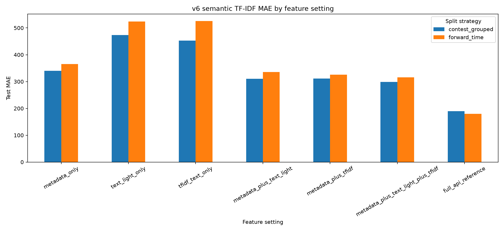
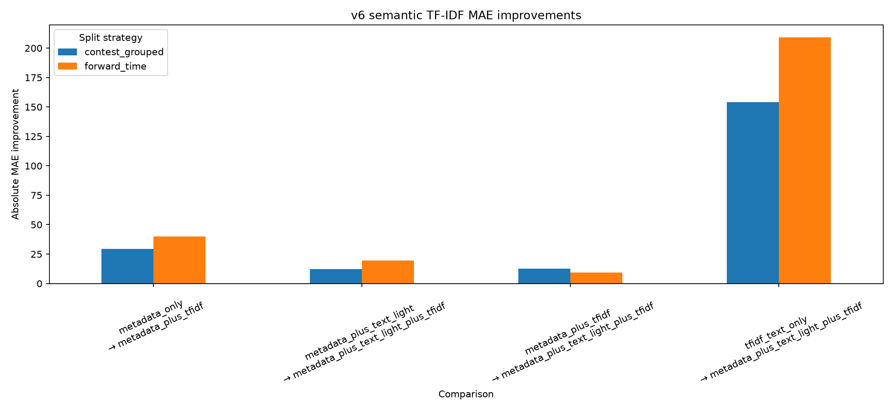

# Semantic Statement Text Modeling for Cold-Start Codeforces Difficulty Prediction

## Abstract

Competitive programming difficulty labels are useful for practice planning, curriculum design, contest analysis, and difficulty-aware recommendation. The previous v5 version of this project showed that Codeforces problem ratings can be predicted from public metadata and solved statistics, but it also showed a clear limitation: when solved-count behavior is removed for cold-start prediction, metadata-only performance becomes much weaker. The v5 statement text-light extension partly addressed this problem by adding shallow structure features from problem statements, such as statement length, section lengths, sample count, numeric-token counts, constraint indicators, keyword flags, time limits, and memory limits. This v6 extension asks whether semantic statement text, represented by a classical TF-IDF bag-of-words model, adds further cold-start signal beyond both metadata and lightweight statement-structure features.

The experiment uses the existing processed model table of 10,979 rated Codeforces programming problems. Statement text rows are matched for all 10,979 problems, with usable text available for 10,906 problems, giving 99.3351% text availability. The semantic representation uses TF-IDF on normalized combined statement text with unigram and bigram features and a maximum vocabulary size of 20,000. The experiment evaluates seven feature settings under contest-grouped and forward-time splits: metadata-only, text-light-only, TF-IDF-only, metadata plus text-light, metadata plus TF-IDF, metadata plus text-light plus TF-IDF, and a full API reference.

The results are conservative but positive. TF-IDF alone is weak, with MAE 452.7 under contest-grouped evaluation and 525.4 under forward-time evaluation. However, metadata plus TF-IDF improves over metadata-only by 29.4 MAE points in the contest-grouped split and 40.0 points in the forward-time split. Adding TF-IDF on top of metadata plus text-light improves MAE by 12.1 points under contest grouping and 19.6 points under forward-time validation. These results suggest that classical semantic statement text features contain complementary cold-start signal, especially under chronological validation. The result should not be interpreted as deep algorithmic understanding, strict pre-contest prediction, or a replacement for the canonical v5 full API benchmark.

## 1. Introduction

Competitive programming platforms contain large collections of algorithmic problems, but their difficulty labels are not always available or reliable at the exact moment when a problem is created, selected for a practice set, or used in a learning sequence. On Codeforces, official problem ratings are widely used because they give learners a rough estimate of how difficult a problem may be. A rating can help a beginner avoid problems that are too advanced, help an experienced contestant find problems at the edge of their ability, and help a training platform organize problems into a meaningful progression. Difficulty prediction is therefore not only a modeling exercise. It also relates to educational recommendation, curriculum design, contest preparation, and problem-set calibration.

The broader project studies whether Codeforces problem ratings can be predicted from public information. Earlier versions focused on API metadata and solved-count behavior. The v5 version separated two scenarios. The first is post-publication prediction, where solved-count statistics are available after a problem has been exposed to users. The second is cold-start prediction, where solved-count behavior is excluded and the model must rely on metadata and statement-derived information. This distinction is essential because solved count is a very strong signal, but it is not available for a newly released problem and is confounded by exposure, age, popularity, and visibility.

The v5 statement text-light extension introduced a first step toward using problem statements in the cold-start setting. It extracted shallow structure features from public Codeforces problem pages: statement length, input/output section lengths, note length, sample count, number count, mathematical-symbol count, code-like token count, constraint-related keyword counts, and time and memory limits. These features improved cold-start performance when combined with metadata. However, they were intentionally not semantic. They could measure whether a statement is long, has many examples, or contains certain visible keywords, but they could not represent the actual wording or topic content of the problem statement.

The v6 extension asks the natural follow-up question: can semantic problem-statement text features improve cold-start Codeforces difficulty prediction beyond metadata and lightweight statement-structure features? The word semantic is used carefully here. This paper does not use a transformer, a sentence embedding model, a code-generation model, or a large language model. Instead, it uses TF-IDF, a classical sparse bag-of-words representation. TF-IDF can capture words and short phrases such as graph, tree, array, query, shortest path, substring, probability, dynamic programming, and binary search. It can also capture some local phrase patterns through bigrams. However, it does not solve problems, reason about constraints, infer intended algorithms, or understand proofs.

This paper reports the v6 semantic TF-IDF extension as a standalone research extension to the v5 project. It does not overwrite or replace the v5 paper. The central contribution is narrower: it tests whether a simple semantic text representation adds measurable cold-start signal beyond the metadata and text-light structure features already studied in v5.

This paper makes four contributions. First, it adds a reproducible statement-text extraction layer that converts cached Codeforces problem-page HTML into normalized text fields for title, statement body, input, output, note, examples, and combined text. Second, it adds a leakage-aware TF-IDF cold-start experiment that fits the text vectorizer only on training rows and excludes solved-count behavior from all cold-start settings. Third, it compares TF-IDF alone, text-light alone, metadata-only, and combined feature settings under both contest-grouped and forward-time evaluation. Fourth, it shows that TF-IDF alone is weak but becomes useful as a complementary feature source when combined with metadata and statement-structure features.

The main empirical conclusion is moderate. TF-IDF statement text should not be treated as a standalone difficulty model. It is much weaker than metadata-based models by itself. However, adding TF-IDF to metadata improves cold-start MAE by 29.4 rating points under contest-grouped evaluation and 40.0 points under forward-time evaluation. Adding TF-IDF on top of metadata plus text-light improves MAE by 12.1 and 19.6 points in the two splits. This supports the conclusion that statement text contains additional cold-start information not captured by metadata or shallow structure alone.

## 2. Related Work

This project sits between competitive programming analytics, educational data mining, information retrieval, and machine-learning evaluation under distribution shift. Educational data mining studies how data from learning environments can support prediction, recommendation, feedback, and analysis [@romero2010edm]. Difficulty prediction is related to this tradition because the goal is to estimate how demanding an item is for learners or contestants. Classical educational measurement also studies item difficulty through response patterns and latent ability models [@rasch1960probabilistic]. This project is not an item response theory model because it does not use individual participant histories, but it shares the idea that problem difficulty can be studied through observable item-level data.

Competitive programming problems have also been studied directly. Kim, Cho, and Na proposed a problem-solving guide task for predicting algorithm tags and difficulty levels for competitive programming problems, using Codeforces among other sources [@kim2023psg]. Their work is closer to natural-language modeling of programming problems, while the present project emphasizes transparent public metadata, leakage-aware evaluation, and lightweight text features. The difference is important. A deeper text model may learn richer representations, but a lightweight TF-IDF baseline is easier to audit and reproduce.

Competitive programming datasets also appear in code-generation benchmarks. The APPS benchmark introduced a large set of programming problems to evaluate whether models can generate solutions from natural-language specifications [@hendrycks2021apps]. Such benchmarks show that problem statements contain rich information. However, the task here is different. This project does not attempt to solve the problem or generate code. It predicts the platform's official difficulty rating from public problem-level features.

The v6 extension also connects to classical text representation. TF-IDF is a standard information-retrieval representation that weights terms by their frequency in a document and their rarity across the corpus [@salton1988term]. It is not deep semantic understanding, but it is a strong and reproducible baseline for testing whether words and short phrases in problem statements contain predictive signal. Ridge regression is a natural partner for sparse high-dimensional text features because it provides regularization for correlated and numerous predictors [@hoerl1970ridge].

Finally, the evaluation design is motivated by distribution shift. Randomly splitting problems can overestimate generalization when related problems, contests, or eras appear in both training and testing. Distribution-shift benchmarks such as WILDS emphasize that performance can change when test examples come from different groups or domains [@koh2021wilds]. Wild-Time focuses specifically on temporal shift [@yao2022wildtime]. These ideas motivate the contest-grouped and forward-time splits used throughout the project. The v6 experiment keeps those protocols so that improvements from TF-IDF are evaluated under the same leakage-aware design as v5.

## 3. Data and Statement Text Extraction

The v6 experiment uses the same processed model table as the v5 pipeline. The table contains 10,979 rated Codeforces programming problems. Each row corresponds to a rated problem with identifiers such as contest id and index, official rating, metadata features, tag indicators, and previously extracted statement text-light features. The target variable remains the official Codeforces problem rating.

The semantic extension adds a statement-text artifact derived from cached local Codeforces problem-page HTML. No network access is used during the semantic TF-IDF experiment. The text extraction step reads cached HTML and writes normalized fields for `title_text`, `statement_text`, `input_text`, `output_text`, `note_text`, `examples_text`, and `combined_text`. The TF-IDF experiment uses `combined_text` by default because it combines the visible parts of the problem statement into one document per problem.

Statement-text rows are matched for all 10,979 model-table rows. Usable text is available for 10,906 rows, giving a text availability rate of 99.3351%. The remaining rows are handled conservatively rather than being silently dropped from the overall project context. Missing or unparsable statement text is treated as missing text, and the experiment keeps the distinction between text availability and model-table coverage.

The extraction process is approximate. It removes scripts and styles, strips HTML tags, decodes HTML entities, collapses whitespace, and separates Codeforces-like sections such as statement, input, output, note, and examples. This is sufficient for a reproducible text baseline, but it is not perfect statement reconstruction. Some encoding artifacts may remain, and unusual page structures may be imperfectly parsed. For this reason, the paper treats extracted text as an approximate feature source rather than as a clean formal specification of the problem.

The TF-IDF configuration uses unigrams and bigrams with a maximum of 20,000 features. The vectorizer lowercases text, strips Unicode accents, uses sublinear term frequency, ignores terms that appear in fewer than three documents, and ignores terms that appear in more than 85% of documents. These settings reduce extremely rare noise and extremely common words while preserving a large vocabulary of algorithmic terms and statement patterns.

## 4. Feature Settings and Methods

The v6 experiment compares seven feature settings:

1. `metadata_only`
2. `text_light_only`
3. `tfidf_text_only`
4. `metadata_plus_text_light`
5. `metadata_plus_tfidf`
6. `metadata_plus_text_light_plus_tfidf`
7. `full_api_reference`

The `metadata_only` setting uses cold-start metadata features such as problem index features, point metadata, tag indicators, and contest-derived metadata. It excludes solved-count behavior. This setting represents the structured non-text baseline.

The `text_light_only` setting uses only the lightweight statement-structure features introduced in v5. These include numeric and structural features such as statement length, section lengths, sample count, numeric-token count, keyword counts, time limit, and memory limit. This setting tests whether shallow statement structure is useful without metadata.

The `tfidf_text_only` setting uses only TF-IDF features from the extracted combined statement text. This setting tests whether raw lexical statement content is enough by itself.

The `metadata_plus_text_light` setting reproduces the main v5-style cold-start combination under the v6 ridge-comparison framework. It combines structured metadata with lightweight statement-structure features.

The `metadata_plus_tfidf` setting combines structured metadata with semantic TF-IDF statement features. This comparison directly asks whether semantic statement text improves over metadata-only prediction.

The `metadata_plus_text_light_plus_tfidf` setting combines all cold-start feature sources: metadata, statement-structure features, and TF-IDF statement text. This is the main v6 cold-start setting because it tests whether semantic text adds signal beyond the v5 text-light extension.

The `full_api_reference` setting is included only as an internal reference. It may use solved-count behavior and is not a cold-start setting. In this v6 module, it is trained with ridge regression for comparison consistency. It should not be confused with the canonical v5 full API benchmark, which used stronger tree-based models and achieved lower MAE. The v6 full API row is useful mainly for showing the large gap between post-publication solved behavior and cold-start information.

All v6 settings use ridge regression. This is intentional because TF-IDF produces sparse high-dimensional matrices, and ridge regression is a stable regularized linear model for such inputs. The choice also keeps the comparison consistent across text and non-text settings. The tradeoff is that the v6 full API reference is not directly comparable to the best v5 full API models.

## 5. Experimental Design

The experiment evaluates both the contest-grouped split and the forward-time split. The contest-grouped split assigns all problems from the same contest to the same partition. This reduces contest-level leakage because problems from the same contest often share authorship, topic style, difficulty progression, and contest context. The forward-time split trains on earlier contests and evaluates on later contests. This is a stricter chronological test because it asks whether patterns learned from older contests transfer to newer ones.

The leakage rule is strict for cold-start settings. Cold-start settings exclude raw solved count, log solved count, age-normalized solved features, accepted or submission behavior, participant behavior, and any feature derived from post-publication solve accumulation. Cold-start settings may use metadata, tags, problem index features, points, contest metadata, statement text-light features, and statement TF-IDF features. This is still not strict pre-contest prediction because Codeforces tags may be post-contest metadata. Therefore, the paper describes the task as metadata/statement cold-start prediction rather than strict pre-contest prediction.

TF-IDF is fit inside the model pipeline on training rows only. This prevents vocabulary and inverse-document-frequency statistics from being computed using validation or test text. This matters because fitting TF-IDF before splitting would allow information about the held-out text distribution to enter the training process. The pipeline design therefore treats text preprocessing as part of the model rather than as a global precomputation step.

The main metric is mean absolute error (MAE), measured in Codeforces rating points. MAE is easy to interpret because a 100- or 200-point error has practical meaning for problem recommendation. The experiment also reports root mean squared error, R², within-100 accuracy, and within-200 accuracy. The compact table in this paper focuses on MAE and within-200 because they are the most directly interpretable for difficulty prediction.

## 6. Results

Table 1 reports the main v6 results for all seven feature settings across the two evaluation splits.

| Feature setting | Contest-grouped MAE | Contest-grouped within-200 | Forward-time MAE | Forward-time within-200 |
|---|---:|---:|---:|---:|
| metadata_only | 340.512361 | 0.361934 | 365.375241 | 0.282516 |
| text_light_only | 473.730895 | 0.247130 | 524.097821 | 0.200959 |
| tfidf_text_only | 452.692704 | 0.277946 | 525.405841 | 0.242537 |
| metadata_plus_text_light | 310.631480 | 0.403625 | 335.807583 | 0.319829 |
| metadata_plus_tfidf | 311.090840 | 0.400604 | 325.373903 | 0.365672 |
| metadata_plus_text_light_plus_tfidf | 298.503755 | 0.441692 | 316.199531 | 0.367271 |
| full_api_reference | 189.483811 | 0.629607 | 179.814188 | 0.638593 |



### 6.1 TF-IDF alone is weak

The `tfidf_text_only` setting performs poorly by itself. In the contest-grouped split, it reaches MAE 452.692704 and within-200 accuracy 0.277946. In the forward-time split, it reaches MAE 525.405841 and within-200 accuracy 0.242537. These results are much worse than metadata-only in both splits.

This is an important negative result. It prevents an inflated interpretation of semantic text modeling. The words in a statement do contain information, but raw TF-IDF text alone is not enough to predict Codeforces difficulty accurately. A statement may mention graphs, trees, arrays, or queries, but difficulty depends on the intended insight, constraints, proof burden, implementation complexity, and contest context. TF-IDF can detect lexical topic signals, but it cannot reconstruct the solution.

### 6.2 Metadata plus TF-IDF improves over metadata only

Adding TF-IDF to metadata improves performance in both splits. In contest-grouped evaluation, metadata-only has MAE 340.512361, while metadata plus TF-IDF has MAE 311.090840. This is an absolute improvement of 29.421521 rating points, or 8.640368% relative improvement.

In forward-time evaluation, metadata-only has MAE 365.375241, while metadata plus TF-IDF has MAE 325.373903. This is an absolute improvement of 40.001338 rating points, or 10.948015% relative improvement.

This result shows that statement text contains signal not captured by structured metadata alone. The improvement is larger in the forward-time split, suggesting that lexical statement content may be especially useful when predicting later contests from earlier ones.

### 6.3 TF-IDF improves over text-light features when combined with metadata

The main v6 comparison is whether TF-IDF adds value beyond the v5-style text-light features. In contest-grouped evaluation, metadata plus text-light has MAE 310.631480. Adding TF-IDF reduces MAE to 298.503755, an improvement of 12.127725 rating points, or 3.904216%.

In forward-time evaluation, metadata plus text-light has MAE 335.807583. Adding TF-IDF reduces MAE to 316.199531, an improvement of 19.608052 rating points, or 5.839074%.

This comparison supports the central v6 claim: semantic TF-IDF statement features add complementary cold-start signal beyond lightweight statement-structure features. The gain is smaller than the gain from adding text-light to metadata in v5, but it is still meaningful, especially under chronological validation.

### 6.4 Combined features are stronger than TF-IDF alone

The combined setting strongly outperforms TF-IDF alone. In contest-grouped evaluation, `tfidf_text_only` has MAE 452.692704, while `metadata_plus_text_light_plus_tfidf` has MAE 298.503755. In forward-time evaluation, `tfidf_text_only` has MAE 525.405841, while the combined setting has MAE 316.199531.

This pattern shows that TF-IDF is best interpreted as a complementary text signal rather than a standalone difficulty model. Metadata gives contest and tag context. Text-light features give structural cues. TF-IDF gives lexical content cues. The strongest cold-start setting in v6 combines all three.

### 6.5 Full API reference is not the v5 benchmark

The `full_api_reference` row has the lowest MAE in both splits: 189.483811 under contest-grouped evaluation and 179.814188 under forward-time evaluation. This is expected because it can use solved-count behavior, which is unavailable in cold-start prediction.

However, this row must be interpreted carefully. The v6 full API reference uses ridge regression for internal comparison consistency. It should not replace the canonical v5 full API benchmark, where stronger tree-based models achieved substantially lower MAE. The full API reference in v6 simply reminds the reader that post-publication solved behavior remains far more predictive than cold-start metadata or statement text.

## 7. Improvement Analysis

Table 2 summarizes the main improvement comparisons. Positive values mean the comparison setting has lower MAE than the baseline.

| Split | Baseline setting | Comparison setting | Baseline MAE | Comparison MAE | Absolute MAE improvement | Percent MAE improvement |
|---|---|---|---:|---:|---:|---:|
| contest_grouped | metadata_only | metadata_plus_tfidf | 340.512361 | 311.090840 | 29.421521 | 8.640368% |
| forward_time | metadata_only | metadata_plus_tfidf | 365.375241 | 325.373903 | 40.001338 | 10.948015% |
| contest_grouped | metadata_plus_text_light | metadata_plus_text_light_plus_tfidf | 310.631480 | 298.503755 | 12.127725 | 3.904216% |
| forward_time | metadata_plus_text_light | metadata_plus_text_light_plus_tfidf | 335.807583 | 316.199531 | 19.608052 | 5.839074% |



The improvement pattern is consistent. TF-IDF helps when added to metadata, and it also helps when added to metadata plus text-light. The forward-time improvements are larger than the contest-grouped improvements in both comparisons. This matters because the forward-time split is the stricter generalization setting. If an improvement only appeared in contest-grouped validation, it might be easier to dismiss as contest-specific or group-specific. The fact that the larger gain appears in chronological validation makes the semantic text signal more interesting.

At the same time, the improvement is not large enough to close the gap between cold-start prediction and post-publication prediction. The best v6 cold-start setting, metadata plus text-light plus TF-IDF, has MAE 298.503755 under contest-grouped evaluation and 316.199531 under forward-time evaluation. The full API reference is still much stronger. This confirms the broader conclusion from v5: solved behavior is a dominant post-publication signal, while cold-start prediction remains difficult.

## 8. Discussion

The v6 results support a careful conclusion: classical semantic statement text features improve cold-start difficulty prediction when used with structured metadata and text-light features. The result is useful because it answers a specific gap left by v5. V5 showed that statement structure helps, but it did not test whether the actual words of the statement add further information. V6 shows that they do.

The positive result is not that TF-IDF understands algorithms. It does not. Rather, TF-IDF likely captures visible topic and vocabulary signals that are correlated with difficulty. For example, terms related to graph traversal, shortest paths, queries, dynamic programming, probability, strings, geometry, or constructive tasks may carry information about typical problem difficulty. Bigrams may also capture local expressions that are common in certain problem families. These signals are incomplete, but they are not useless.

The weakness of TF-IDF-only prediction is equally important. A problem statement cannot be reduced to its words without losing crucial information. Many easy and hard problems share similar vocabulary. A simple graph problem and a difficult graph problem both mention vertices and edges. A dynamic programming problem may be straightforward or highly non-obvious. The difficulty often comes from hidden insight, constraints, proof, or implementation details that bag-of-words features cannot fully represent.

The best interpretation is therefore compositional. Metadata contributes contest context, tags, index position, point information, and other structured signals. Text-light features contribute statement shape, section structure, examples, constraints, and visible complexity indicators. TF-IDF contributes lexical content. None of these sources fully determines difficulty alone, but their combination improves cold-start prediction.

The forward-time result is particularly useful for research framing. The improvement from adding TF-IDF is larger under forward-time validation than contest-grouped validation. This suggests that statement text features may generalize across time in a way that complements metadata. However, this is still an offline historical result. It does not prove future deployment performance or strict pre-contest reliability.

## 9. Limitations

This study has several limitations.

First, TF-IDF is a bag-of-words representation. It cannot truly understand algorithmic reasoning, infer intended solutions, compare asymptotic complexity, or reason formally about constraints. It can identify terms and short phrases, but it cannot solve the problem.

Second, statement text extraction is approximate. The extractor relies on cached Codeforces HTML and conservative parsing. Some pages may contain unusual markup, missing sections, or encoding artifacts. These artifacts do not invalidate the experiment, but they limit how strongly the text representation should be interpreted.

Third, tags may be post-contest metadata. Therefore, the v6 cold-start setting is metadata/statement cold-start rather than strict pre-contest prediction. A stricter pre-contest experiment would need to exclude any metadata unavailable before or during a contest.

Fourth, the v6 full API reference is ridge-based and is not the canonical v5 benchmark. It is included for internal comparison consistency inside the TF-IDF experiment, not as a replacement for the stronger v5 full API models.

Fifth, no deep language model is used. This is deliberate. The goal is to establish a lightweight, reproducible semantic baseline before considering heavier models such as transformers, sentence embeddings, or code-aware language models.

Sixth, the experiment uses one historical snapshot. Codeforces is a living platform: ratings, solved counts, tags, contest styles, and user behavior may change over time. Future snapshots may produce different results.

Finally, v6 does not replace v5. It extends the cold-start analysis by adding semantic statement text. The main v5 conclusions about solved-count strength, exposure confounding, temporal validation, and statement text-light improvement remain relevant.

## 10. Conclusion

The v6 semantic TF-IDF extension shows that problem-statement text contains useful cold-start signal for Codeforces difficulty prediction. TF-IDF alone is weak, but metadata plus TF-IDF improves over metadata-only prediction, and metadata plus text-light plus TF-IDF improves over metadata plus text-light. The gains are larger under forward-time validation than contest-grouped validation.

The most defensible conclusion is that classical statement text features add complementary signal beyond metadata and lightweight statement structure. This is a meaningful extension of v5, but it is not a final model of intrinsic algorithmic difficulty. The model still does not understand solutions, and the cold-start setting still depends on metadata such as tags that may not be available before a contest.

Future work could test stricter pre-contest feature availability, compare TF-IDF with modern sentence embeddings, add solution-independent constraint parsing, study temporal solved-count trajectories, or evaluate cross-platform transfer to AtCoder, USACO-style problems, or other competitive programming datasets. The current contribution is a reproducible and conservative semantic text baseline that strengthens the cold-start part of the Codeforces difficulty prediction project.

## 11. Reproducibility Notes

The v6 semantic extension can be reproduced from the repository root after the required local data artifacts exist.

Statement text extraction:

```powershell
$env:PYTHONPATH = "src"
python -m cf_diff.statement_text `
  --feature-path data/processed/features/model_table.parquet `
  --cache-dir data/raw/codeforces/problem_pages `
  --output-dir data/processed/statement_text `
  --log-path outputs/logs/statement_text.log
```

Semantic TF-IDF experiment:

```powershell
$env:PYTHONPATH = "src"
python -m cf_diff.semantic_tfidf `
  --feature-path data/processed/features/model_table.parquet `
  --statement-feature-path data/processed/statement_features/statement_features.parquet `
  --statement-text-path data/processed/statement_text/statement_text.parquet `
  --contest-split-path data/processed/splits/contest_grouped_split.parquet `
  --time-split-path data/processed/splits/forward_time_split.parquet `
  --output-dir outputs/semantic_tfidf `
  --log-path outputs/logs/semantic_tfidf.log
```

Semantic results summary:

```powershell
$env:PYTHONPATH = "src"
python -m cf_diff.semantic_results `
  --metrics-path outputs/semantic_tfidf/tables/semantic_tfidf_best_by_setting.csv `
  --summary-path outputs/semantic_tfidf/summary/semantic_tfidf_summary.json `
  --output-dir outputs/semantic_tfidf/results_summary `
  --log-path outputs/logs/semantic_results.log
```

Test command:

```powershell
$env:PYTHONPATH = "src"
python -m pytest -q
```

Generated `outputs/` files are local analysis artifacts and should not be committed. The paper source is `paper/paper_v6_semantic_tfidf.md`. If the paper is rendered to PDF, the two v6 result figures should be copied from the local results-summary output into `paper/figures/` so that the Markdown figure paths resolve.

## References

[@codeforces_api_methods]: Codeforces. *Codeforces API Methods*. Official API documentation.

[@codeforces_api_objects]: Codeforces. *Codeforces API Return Objects*. Official API documentation.

[@romero2010edm]: Romero, C., & Ventura, S. (2010). Educational data mining: A review of the state of the art. *IEEE Transactions on Systems, Man, and Cybernetics, Part C: Applications and Reviews*, 40(6), 601–618.

[@rasch1960probabilistic]: Rasch, G. (1960). *Probabilistic Models for Some Intelligence and Attainment Tests*. Danish Institute for Educational Research.

[@kim2023psg]: Kim, J., Cho, E., & Na, D. (2023). Problem-Solving Guide: Predicting the Algorithm Tags and Difficulty for Competitive Programming Problems. arXiv:2310.05791.

[@hendrycks2021apps]: Hendrycks, D., Basart, S., Kadavath, S., Mazeika, M., Arora, A., Guo, E., Burns, C., Puranik, S., He, H., Song, D., & Steinhardt, J. (2021). Measuring Coding Challenge Competence With APPS. arXiv:2105.09938.

[@salton1988term]: Salton, G., & Buckley, C. (1988). Term-weighting approaches in automatic text retrieval. *Information Processing & Management*, 24(5), 513–523.

[@hoerl1970ridge]: Hoerl, A. E., & Kennard, R. W. (1970). Ridge Regression: Biased Estimation for Nonorthogonal Problems. *Technometrics*, 12(1), 55–67.

[@koh2021wilds]: Koh, P. W., Sagawa, S., Marklund, H., Xie, S. M., Zhang, M., Balsubramani, A., Hu, W., Yasunaga, M., Phillips, R. L., Gao, I., Lee, T., David, E., Stavness, I., Guo, W., Earnshaw, B. A., Haque, I. S., Beery, S., Leskovec, J., Kundaje, A., Pierson, E., Levine, S., Finn, C., & Liang, P. (2021). WILDS: A Benchmark of in-the-Wild Distribution Shifts. arXiv:2012.07421.

[@yao2022wildtime]: Yao, H., Choi, C., Cao, B., Lee, Y., Koh, P. W., & Finn, C. (2022). Wild-Time: A Benchmark of in-the-Wild Distribution Shift over Time. arXiv:2211.14238.
